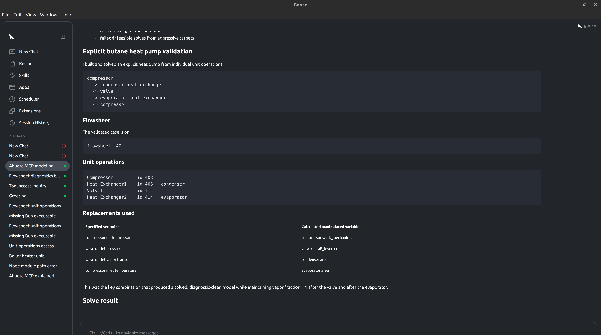
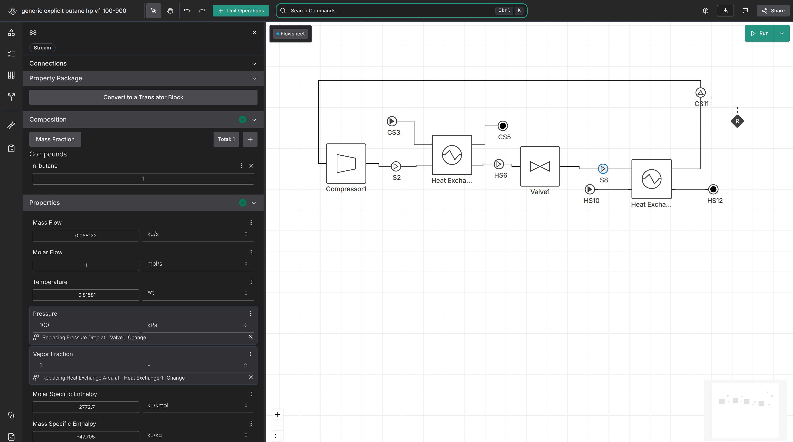

By getting gpt 5.5 to learn how the variable replacement works and how the MCP server works, it has successfully generated a steam-generating heat pump flowsheet.

We have a good set of tools for it to use now, with pretty readable diagnostics methods when things go wrong, making it much easier for a LLM to understand what the flowsheet is doing.

