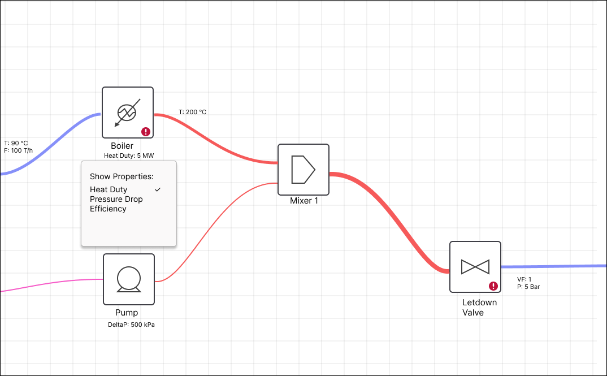

What more could be possible?

This diagram visualises flow rates and temperature change, which gives a lot of insight onto what's going on. How could we visualise Pressure change, or composition change on streams? What about power or efficiency on unit operations?

Should we add dials or "speedometers" rather than just numbers?

Could we use motion, drop shadows, line styling, unit operation styling, etc?

How can we put more UI elements where they actually live/are used, rather than just dumping them in a sidebar or menu? (e.g having tools pop up when you click on a unit operation, or use right-click menus or hover better)

What would images/sticky notes etc look like?