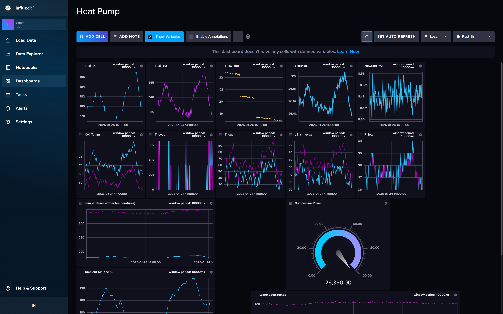
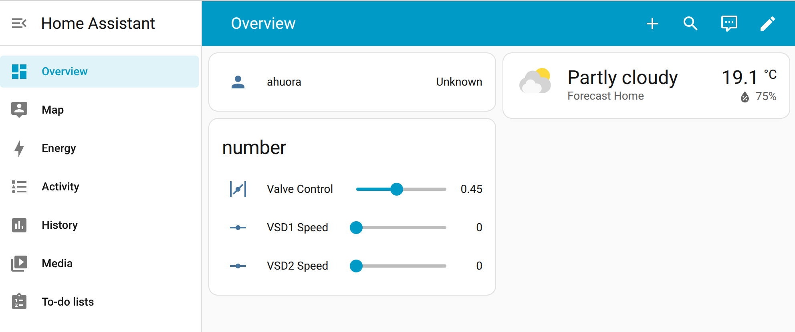

> For more information, see [https://github.com/bertkdowns/heat-pump-modbus-decoding](https://github.com/bertkdowns/heat-pump-modbus-decoding)

This heat pump is setup as a simple testing rig, heating up water in a simple loop. a heat exchanger is used that is in a seperate loop with a cooling tower to cool down the heated water, and then the water is heated up again by the heat pump.

# Some things about this setup

- The valve we had was a ball valve, which doesn't make precise control easy. It was hard to get a consistent operating point. 
- We reverse engineered both the modbus protocol (using a digital logic analyser and software to figure out the baud rate etc) and the HIOKI power logger. This made things take a bit longer than they would if we had good SDKs or explanations for both of these.
- The common communication layer ended up being MQTT - because this makes it easy to have one system subscribe to everything and store all history (influxdb), and its simple enough to get working with pretty much anything.  Inside a private network we don't have to worry as much about security, but adding security doesn't seem too bad if it is needed too. Retained messages is also super helpful, though outside of retained messages you kinda got to keep track of the state yourself. Could be paired with OPC-UA well potentially, where opc-ua keeps the current state for things that are run periodically, and mqtt is used to update it when anything changes. There might be libraries that help with this too. A good question around DTs is if they should be event driven, or just run periodically.
- I think generally, getting all data into the same format as fast as possible is really important. MQTT worked well for this, but if you had a different system, potentially you could just use a NI CDAQ data logger for everything for example. However, that is probably not realistic.
- Home assistant actually worked really well for a simple control system. It has made me wonder about the need for conventional SCADA systems even. InfluxDB was also a really good data collection platform. Aparently Grafana is good for viewing the data too.

To me, one of the key features for homeassistant was that you can define the configuration for everything as yaml files that can be version controlled - saying which sensor is connected to which MQTT channel etc. The only thing you can't version control is the connection to the MQTT broker ( you've gotta set that up in the app but once you do it auto-populates the dashboard.)

From this, i am also thinking that node-red is probably overkill for digital twins. I think that even for a data preprocessing workflow, I'd maybe send it to/from MQTT (i.e it gets data from MQTT, then publishes the results to MQTT). That way the data preprocessing workflow can preprocess some of the data, but you can use raw data for other stuff, and it's simply a matter of subscribing to the right channels. 

Having good typing for MQTT so you know what formats the data is in would improve things a lot, so that's gonna be an area to look into. AsyncAPI seems to be the standard. Potentially, applications that auto-generate asyncAPI schemas from the data sources they identify and provide would be a big win: compile all the channel schemas together and then you have a full description of all your data sources (preprocessed and raw), and even your control signals, making it easy to use them in other apps. You should be able ot auto-generate a full SDK for pretty much any language you ever need.

# What's next

This provides a really good example of the lowest levels: what actually collecting the data looks like in the real world. 

The next step is to build up and try connect it to the ahuora platform. The platform can solve models really well, but it's hard to make a model that makes sense from this data. E.g we only have temperatures and power, how does that actually correlate to our model? There's a lot of stuff missing:

- Efficiency curves from power to mechanical work
- Heat exchanger areas and heat transfer coefficients
- Air flow rates in and out of the heat pump
- converting fluid flow rate from mA signal to a kg/h or mol/s value
- pressures in the heat pump

Of the "things we don't know" about the heat pump, there are a few different ways we can obtain it:

- Directly predict from first principles things that we do know (E.g there should be a formula to convert from mA to flow rate for the flow meter. This also includes all "results" calculated via idaes)
- Use our engineering knowledge to figure out a value or way to calculate/approximate it (e.g check design docs for HX area specification or the pump efficiency curves)
- Regress it using some sort of machine learning technique. However, you need to come up with a sensible loss function for this which means either your other data has to be over-defined, or you might have to enforce some kind of prior to get a good solution.

You could treat the entire thing as a parameter estimation problem, where you bake in all the physics you know, and all the values you know, and then you parameter estimate everything else every single time. potentially using online estimation techniques.

# other ideas

How can we add reproducibility and testibility? recording mqtt sessions so you can virtualise the input data? could we virtualise the plant and end up with a playground, where the live data isn't used, but the correlations or control system alone is used, with ml to predict what we think the live data would do in response?

