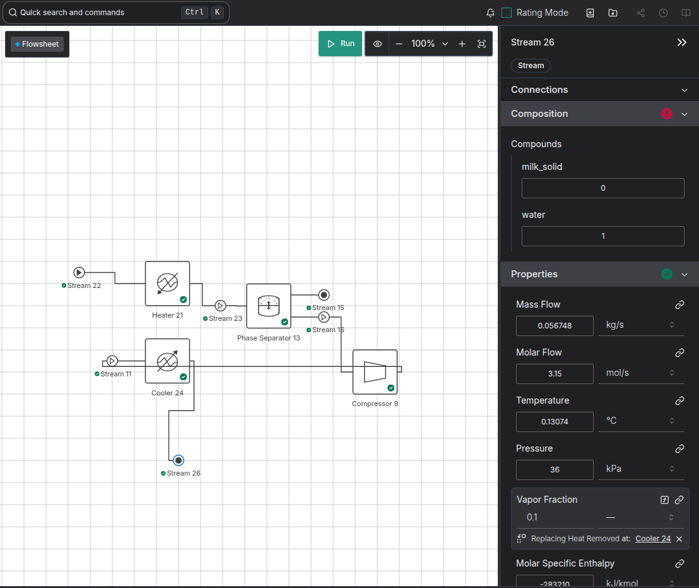

- Using a heat exchanger means you need a recycle. The platform doesnt create one automatically but you can create one by dragging in a heater, connecting its inlet to its outlet, and then moving the created recycle, and deleting the heater.
- Recycles cause all sorts of problems, and heat exchangers are hard to debug. That's because they need the temperatures to be feasible, and there to be enough heat in the streams to actually transfer. So I switched to a seperate heater/cooler to make it easier to debug.
- With our current milk property package, from ahuora_compounds v0.0.25, the first generic milk property package, the dew/boiling point is way off for pure water, which means it doesn't work. 

There were some problems with solving, where initialisation was failing even though the problem should be solvable. These problems were more prevalent in a big flowsheet. 
This sparked a seperate investigation about [[ahuora.initialisation-storing-previous-model-state]].


# Scaling Problems


```
Normal IPOPT solver with user scaling
  flow_mass     success      jacobian
0        27     E  3.761699e+13
1        28     F  1.370097e+13
2        29     S  3.844978e+13
3        30     F  1.521089e+13
4        31     F  1.661002e+13

IPOPT-Watertap with user scaling
   flow_mass success      jacobian
0         27       F  1.078358e+15
1         28       E  3.761699e+13
2         29       E  3.761699e+13
3         30       F  7.540741e+12
4         31       F  1.552854e+13


IPOPT-Watertap with user scaling plus constraint_scaling_transform
   flow_mass success      jacobian
0         27       F  4.250624e+17
1         28       F  3.026048e+18
2         29       F  4.288970e+17
3         30       F  2.585646e+16
4         31       F  2.597704e+24

IPOPT-Watertap with user scaling plus constraint_scaling_transform (inverted)
   flow_mass success      jacobian
0         27       F  5.735200e+22
1         28       E  5.254578e+17
2         29       F  5.352988e+17
3         30       E  5.254578e+17
4         31       E  5.254578e+17

IPOPT with user scaling plus constraint_scaling_transform
   flow_mass success      jacobian
0         27       F  1.212650e+20
1         28       F  4.032520e+18
2         29       S  4.231969e+17
3         30       F  3.114196e+18
4         31       F  2.058755e+17

```


Main Parameter Sweep
```
Solving with normal tolerance
  27 28 29 30 31 32 33
0  F  F  F  F  S  S  F  (gradient)
1  F  F  F  F  F  F  F  (equilibriation)
2  E  F  F  S  F  S  F  (none)
3  E  F  S  F  F  F  F  (user-specified)
4  F  F  S  F  F  F  F  (ruiz)
5  S  E  S  F  E  F  F  (idaes auto-scaling)


Solving with tol=1e-3, then on to 1e-8 (F1 means failed solving at tolerance 1e-3)
   27  28  29  30  31  32  33
0   E   S   S  F1  F3   S   E (gradient)
1  F1  F1  F1  F1  F1  F1  F1  (equilibriation)
2   E   E  F1   E   F   E   E  (none)
3  F1  F1   S  F1  F1  F1  F1  (user-specified)
4  F1  F1   S  F1  F1  F1  F1  (ruiz)
5   E   E   S  F1   E   E  F1  (idaes auto-scaling)

Jacobians of each type of scaling
       gradient  equilibriation          none  user-specified          ruiz    idaes auto
0  7.585028e+19    7.585028e+19  7.585028e+19    3.761699e+13  1.115060e+16  1.593809e+16
```
So decreasing the tolerance only helped with a few cases of idaes's gradient-based scaling, nothing else. and it made some other cases fail. Doesn't look like that good of a strategy.

User specified scaling only helped for one case, which probably means I didn't do a good job of it. And it was also a case that RUIZ and idaes auto scaling passed - though they might have been relying on my user-specified scaling, I'll have to run them independently (scaling factors may have been applied on top of each other.) Gradient scaling passed in places that user scaling did not, which is interesting.

I think i'll have to look more into SVD decomposition and closer into the jacobian to improve things more.


The code is accessible at [https://github.com/waikato-ahuora-smart-energy-systems/idaes-mcp/blob/d67db9075552e0204d83e1f6edf8ac08fdce42ae/examples/ahuora_flowsheet.py](https://github.com/waikato-ahuora-smart-energy-systems/idaes-mcp/blob/d67db9075552e0204d83e1f6edf8ac08fdce42ae/examples/ahuora_flowsheet.py). 

parameter_sweep.py shows the small runs, and ahuora_flowsheet.py shows the big run.

Note that this took like 8 hours to run, because if it fails to solve, IPOPT spends like 5 minutes trying.