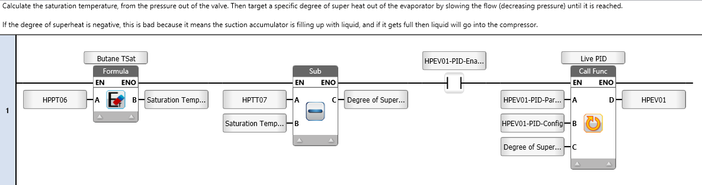
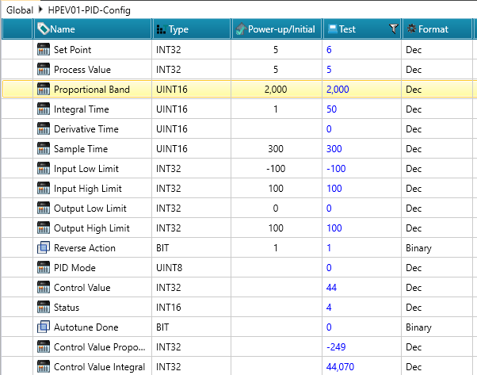
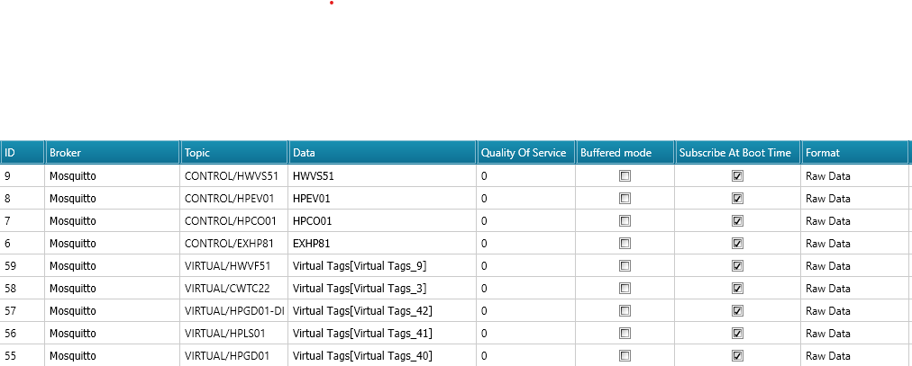
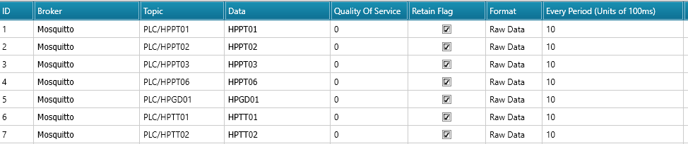

> For more information, see [https://github.com/bertkdowns/sghp-twin](https://github.com/bertkdowns/sghp-twin)

# Overview

The University of Waikato is building a small scale steam generating heat pump, to get experience in the process of getting and building one and to pave the way for industry to do the same in the future.

As part of this, we have got a PLC that controls the steam generating heat pump. I have set up the PLC to be able to control the heat pump, but we didn't have the heat pump on hand as it was still being built. An excelent way to test the PLC control system and interface then, is to virtualise the heat pump.


This uses a Digital Twin to model the process. The PLC decides what valve opening fraction, pump speed, etc to set, and this is then sent over MQTT to the computer running the Digital Twin. The digital twin calculates what the pressures and temperatures etc would be in response, and then sends this data back to the PLC. The PLC can then make controlling actions in response to this.

## Working with PLCs

PLCS make building PID controllers pretty easy, and linking up lots of different inputs etc. There isn't too much of a learning curve to figure it out and start building interfaces etc. It helps that pretty much everything's a global variable.

However working with ladder is painful for complex logic. I think PLCs are definitely best for input mapping - getting the physical inputs to a semantic tag and range that makes sense (e.g voltage to temperature conversion, etc). It's best to then get them to talk over MQTT to offload more complex logic. It's nice that they support a range of protocols (at least unilogic's one does) though if they didn't I'd probably standardise on MQTT anyway and then have some sort of bridge service to convert to/from.


The tag system works well for this. Giving each variable a unique tag makes it easy to reference it anywhere you need, and then it's just a matter of mapping the input readings to those tags, defining appropriate ranges etc. Likewise, data is recieved from MQTT and stored in a tag, or sent over MQTT based on the tag.


The simplicity of this approach makes interoperating with other systems much easier: as long as you know the tags for the data, it's usually pretty easy to get everything you need. This inspired adding the same functionality to the Ahuora Platform, allowing you to give a property a tag.


This can be exported as JSON to be used in the digital twin or other scripts, linking the PropertyValue (the ID in the exported IDAES model) to the conventional tag and providing relevant units. 

```json
[
        "CWTC22": {
        "property": 617348,
        "units": "degC"
    },
]
```

In this image, HPMF01 and HPTT05 are both tags from the PLC. However, we can create more custom tags, such as we have done for vapor fraction. These will be ignored by the PLC, but are able to be ingested by the scada system or data historian, allowing us to view them over time in the same way as we view real process data (effectively creating a "soft sensor").


## Ladder Code



This piece of ladder code uses a custom function to calculate the saturation temperature from the pressure using Antoine's equation for butane. The result is stored in a global variable. Then this is used to calculate the degree of superheat present from the temperature after the evaporator. Then a direct contact is used on the bit variable to check if the PID is enabled. if it is, then the PID will be run as well. 

A full explanation of Ladder code is avaliable in the [UniLogic Manual](https://www.unitronicsplc.com/Download/SoftwareHelp/!UniLogicWebhelp2024/#t=Ladder%2FLadder_Elements%2FLF_Basic_Elements%2FLF__Contacts.htm).


## PID Control


We added screens to the PLC to update the PID control parameters. These do not work exactly as I expected: P controls the porportional band, and so a higher number actually makes it respond slower. I controls the integral response time, so it's a measure how how many seconds you expect it'll take to reach steady state (so again, higher means the controller reacts slower.) I have the digital twin calculating once every 10 seconds, so I had to make the response quite slow in order to get it to be stable. 

The expansion valve is a hard one to get right. If it is closed to zero, it becomes unstable as there is a vacuum, and the model fails to solve. likewise, if it is opened too far, no gas is created and you start feeding liquid into your compressor, and the model becomes unstable because the heat exchangers can't reach their target temperatures or duties. 

This can be fixed by changing the Output Low Limit from 0 to something solvable (say 30) and likewise the high limit (from 100 down to 60) to ensure the PID system never tries to push the valve opening fraction too far in either direction.



Further information on PID control can be found in the [UniLogic documentation](https://www.unitronicsplc.com/Download/SoftwareHelp/!UniLogicWebhelp2024/#t=PID%2FPID.htm&rhtocid=_18_5_0)


Another thing that helps is to set the appropriate amount of integral error. We do that by calling the "Force Integral Error" block at startup to set the initial integral error to around what we expect.


## A true Digital Twin

On the platform we can set tags for all the variables that are calculated from the platform. These can be sent to the PLC with the VIRTUAL
prefix when we want to virtualise the process.



The PLC can send back signals for the controlling actions it takes (new amount of heat duty, pump speed, mechanical work), from the PID control algorithms. These can then be used as inputs to the simulation (we can automatically detect which things are inputs to the simulation and have tags using the tag mappings).




This actually works pretty well. One problem is when the system is in an unstable state, the platform tries to simulate to steady state. E.g if you have a recycle loop and your heater is on too high, in the real world it would gradually get hotter and hotter. Our platform is simulating a steady state model, and so in steady state temperature is infinite (it would just spiral higher and higher forever) and infeasible. 

This could be remedied in a couple of ways:
- Having some sort of buffer, e.g generic heat loss that pulls variables back down to some maximum
- Specifying different properties (e.g if you specify temperatures and pressures you don't get this problem. However, then you can't use the platform as a "virtual plant emulator")
- Doing one step of a dynamic simulation instead of a steady state simulation (then holdup can actually model it). This will involve adding some holdup/tanks between unit ops, or at least somewhere in the unstable recycles. It'll also take some work to make the platform robust enough to do this.
- Manually do dynamic simulation: Break the recycle loop at some point, and use the previous value (or a percentage of the previous values) output as the input for the next solve. Solve each at steady state.

Breaking the recycle loop at some point works really well for this. For one, it simplifies the model a lot. Two, it better represents what happens in the real world, as changes take time to propogate through the system. Three, it's much simpler than doing a dynamic simulation, as we are still solving a steady state model each time. 

We could even go a step further and add additional points to introduce process lag between unit operations. One caveat is that this doesn't work if you are controlling something further down in the process by DOF replacement. However it works well if you have no DOF replacement in your model, or in this case the DOF replacement could be switched out with a PID controller (TODO: investigate this further.)

The hard part to figure out is how quickly should values be recycled through? This is pretty much a question of defining transfer functions. The advantage of this type of approach is that we could specify time delay in the transfer functions too (by having an array/buffer to store intermediate values), something that can't be approximated well without a 1d buffer (e.g a pipe) in a normal dynamics/DAE simulation. 

Using pyomo and IDAES in this way is more similar to how things would work with modelica and maybe CAPE-OPEN, rather than normal idaes models. However the advantage is you can use the same models for these things and for your steady state model, and use this type of simulation if you want fast simulation online, or switch to a DAE model if you want more robust dynamic optimisation. It would be good to look at how we can switch between the different modes easily - particuarly for this case, variable replacement may work really good for automating converting to/from PID controllers. 


## Some of the problems this has identified:

- Zero flow: This means that everything fails to solve, because if you try do do 1 kW of mechanical work on zero flow you get to infinite pressure. Could probably add a "zero flow" warning and some slack variables to properties that are affected by flow so that it stops caring about them when flow is zero.
- Heat exchangers failing: In theory, U and A heat exchangers should always solve. However, it seems sometimes they fail and calculate that we don't have enough energy to reach an outlet temperature. This could be when we go through the vapor-liquid equilibrium breaking the delta_temperature LMTD or whatever calculation method?
- Valves are often showing that there is a problem between inlet and outlet temperature. However, it is often very small differences between inlet and outlet temperature, so it usually seems to be a numerical precision area as enthalpy is the state var. We should ignore those very small deviations as it clutters up the logs.

- Maybe? Ipopt is starting from start, setting warm_start = true might help once it's solved once (could be overshooting a bit.)

The "recycle whatever you get" strategy doesn't work when you get an infeasible solve as then it recycles and fixes garbage variables. So you should only recycle when you get "optimal solution found".


Next steps: Clean up logs to notify of zero flow, ignore valve issues. 

I would like to look at the slack variable idea to make it more reliable. I would like to try the hierarchical modelling as an alternative fallback strategy if the main model doesn't solve, but that will be a lot of work. 

I also need to set sensible defaults for the p&ID variables and the other outputs so that the model doesn't immediately fail when I turn on the PLC. (right now the pumps are off so the model immediately breaks.)

# The Digital Twin Code

Some helpful debugging this has includes:
Printing how much values have changed from the previous solve. If they are changing significantly it is likely a problem. This helps us narrow down potential causes of failed solves. It is enhanced by having an InfluxDB process historian that allows us to view the results o previous solves as well, and records if the solve was successful or errored at that point. The graphs also let us track the trends of values across time and help us see if things are converging.

In each recycle, every time a solve completes successfully we copy the outlet value across to the inlet. We have a smoothing function so it takes some time for the value to fully propogate across.

```
2026-06-03 11:48:02 [INFO] idaes.ahuora_builder.methods.change_detection: Property: fs.Cooling Tower_1670815.hot_side.properties_out[0.0].flow_mol, Current Value: 9.563196, Previous Value: 9.459320, Change: 1.098135%
2026-06-03 11:48:02 [INFO] idaes.ahuora_builder.methods.change_detection: Property: fs.Subcooler_1670814.cold_side.heat[0.0], Current Value: 9793.127263, Previous Value: 9752.466517, Change: 0.416928%
2026-06-03 11:48:02 [INFO] idaes.ahuora_builder.methods.change_detection: Property: fs.IHX_1670816.cold_side.heat[0.0], Current Value: 103.437967, Previous Value: 103.032281, Change: 0.393747%
2026-06-03 11:48:02 [INFO] idaes.ahuora_builder.methods.change_detection: Property: fs.Evaporator_1670812.hot_side.properties_out[0.0].temperature, Current Value: 355.269758, Previous Value: 354.128877, Change: 0.322165%
2026-06-03 11:48:02 [INFO] idaes.ahuora_builder.methods.change_detection: Property: fs.Pump2_1671255.control_volume.properties_out[0.0].temperature, Current Value: 355.271667, Previous Value: 354.130785, Change: 0.322164%
2026-06-03 11:48:02 [INFO] idaes.ahuora_builder.methods.change_detection: Property: fs.Valve3_1671252.control_volume.properties_out[0.0].temperature, Current Value: 355.271078, Previous Value: 354.130201, Change: 0.322163%
2026-06-03 11:48:02 [INFO] idaes.ahuora_builder.methods.change_detection: Property: fs.Cooling Tower_1670815.hot_side.properties_out[0.0].total_energy_flow, Current Value: 34933.945723, Previous Value: 34853.581041, Change: 0.230578%
2026-06-03 11:48:02 [INFO] idaes.ahuora_builder.methods.change_detection: Property: fs.Cooling Tower_1670815.hot_side.properties_out[0.0].flow_mass, Current Value: 0.172284, Previous Value: 0.170412, Change: 0.187136%
2026-06-03 11:48:02 [INFO] idaes.ahuora_builder.methods.change_detection: Property: fs.Suction Accumulator_1671910.control_volume.properties_out[0.0].pressure, Current Value: 1079824.023469, Previous Value: 1078603.008035, Change: 0.113203%
2026-06-03 11:48:02 [INFO] idaes.ahuora_builder.methods.change_detection: Property: fs.IHX_1670816.hot_side.properties_out[0.0].pressure, Current Value: 1079824.023469, Previous Value: 1078603.008035, Change: 0.113203%
Recycling: 10.498241576494781 -> 9.656700818267254 @ fs.Cooling Tower_1670815.hot_side.properties_in[0.0].flow_mol 0.1 = 9.656700818267254
Recycling: 3868.6192406358628 -> 4466.72414818505 @ fs.Cooling Tower_1670815.hot_side.properties_in[0.0].enth_mol 0.1 = 4466.72414818505
Recycling: -6168.213996104645 -> -1008.002729638122 @ fs.IHX_1670816.hot_side.properties_in[0.0].enth_mol 0.1 = -1008.002729638122
Recycling: 1132045.9820436582 -> 1085046.21932636 @ fs.IHX_1670816.hot_side.properties_in[0.0].pressure 0.1 = 1085046.21932636
Recycling: 935.8869219680124 -> 5657.1809472863015 @ fs.Oil Separator_1671914.control_volume.properties_in[0.0].enth_mol 0.1 = 5657.1809472863015
```

When a solve fails, we use the diagnostics methods to figure out where the problems could be. This is also really helpful.

```
EXIT: Maximum Number of Iterations Exceeded.
WARNING: Loading a SolverResults object with a warning status into
model.name="unknown";
    - termination condition: maxIterations
    - message from solver: Ipopt 3.13.2\x3a Maximum Number of Iterations
      Exceeded.
2026-06-03 11:47:23 [INFO] idaes.ahuora_builder.methods.change_detection: Property: fs.Valve1_1670811.deltaP_inverted[0.0], Current Value: 924556.213020, Previous Value: 826446.280994, Change: 11.871302%
Property Infeasibilities:
2026-06-03 11:47:23 [INFO] idaes.ahuora_builder.flowsheet_manager: fs.Pipe Pressure Loss_1671240.control_volume.properties_out[0.0].temperature Outlet temperature (314.95 K) is more than inlet temperature (314.95 K). Valves can only decrease temperature. Check your formulation of the upstream problem.
2026-06-03 11:47:23 [INFO] idaes.ahuora_builder.flowsheet_manager: fs.Valve2_1671244.control_volume.properties_out[0.0].temperature Outlet temperature (324.52 K) is more than inlet temperature (324.51 K). Valves can only decrease temperature. Check your formulation of the upstream problem.
2026-06-03 11:47:23 [INFO] idaes.ahuora_builder.flowsheet_manager: fs.Valve3_1671252.control_volume.properties_out[0.0].temperature Outlet temperature (358.03 K) is more than inlet temperature (358.03 K). Valves can only decrease temperature. Check your formulation of the upstream problem.
2026-06-03 11:47:23 [INFO] idaes.ahuora_builder.flowsheet_manager: fs.HP Compressor_1670817.control_volume.properties_in[0.0].vapor_frac Inlet vapor fraction is 0.80. Compressors are typically used for gases,
                    as liquids are incompressible.
                    This low vapor fraction may indicate a problem with your formulation upstream.
2026-06-03 11:47:23 [INFO] idaes.ahuora_builder.flowsheet_manager: fs.Condenser_1670810.overall_heat_transfer_coefficient The heat exchanger has used all the cooling available in the cold side. Temperature difference between HS outlet and CS inlet is  (-0.20 K). There needs to be a temperature difference to drive heat transfer. Perhaps there is insufficient cooling in the cold side or too much heat in the hot side.
2026-06-03 11:47:23 [INFO] idaes.ahuora_builder.flowsheet_manager: fs.Evaporator_1670812.overall_heat_transfer_coefficient The heat exchanger has used all the heat available in the hot side. Temperature difference between HS inlet and CS outlet is  (-0.00 K). There needs to be a temperature difference to drive heat transfer. Perhaps there is insufficient energy in one of the streams.
2026-06-03 11:47:23 [INFO] idaes.ahuora_builder.flowsheet_manager: fs.Valve1_1670811.control_volume.properties_out[0.0].temperature Outlet temperature (335.76 K) is more than inlet temperature (335.68 K). Valves can only decrease temperature. Check your formulation of the upstream problem.
2026-06-03 11:47:23 [INFO] idaes.ahuora_builder.flowsheet_manager: fs.Flash Valve_1670818.control_volume.properties_out[0.0].temperature Outlet temperature (362.09 K) is more than inlet temperature (362.06 K). Valves can only decrease temperature. Check your formulation of the upstream problem.
Error occurred while solving the flowsheet: Solver failed to return an optimal solution. Solution status: warning, Termination condition: maxIterations
2026-06-03 11:47:33 [INFO] idaes.ahuora_builder.flowsheet_manager: === Starting Solve ===
```