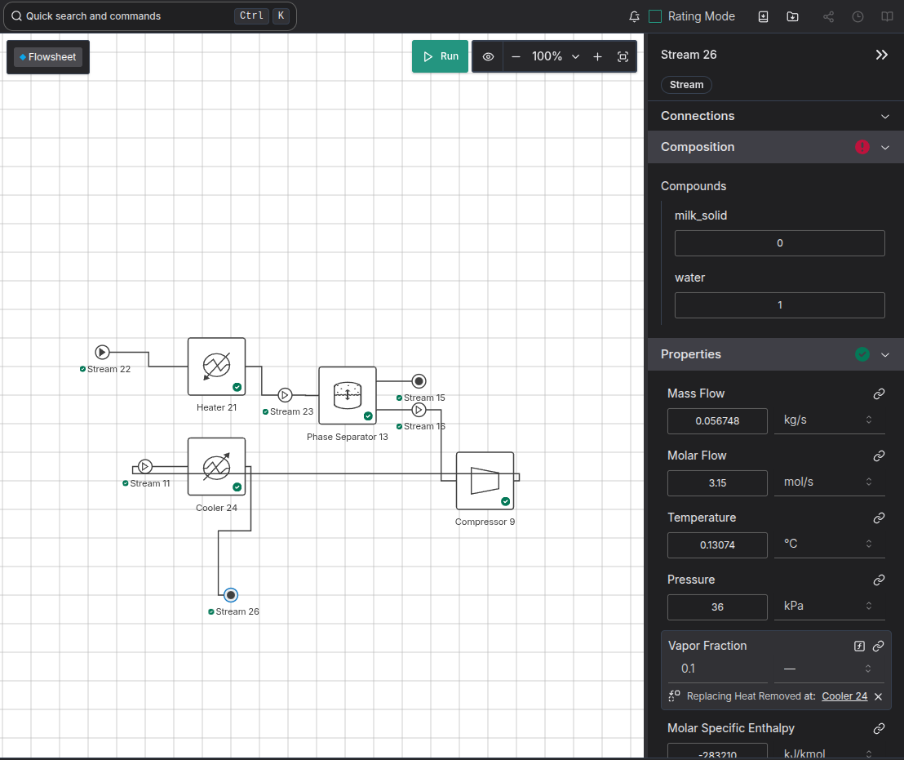

- Using a heat exchanger means you need a recycle. The platform doesnt create one automatically but you can create one by dragging in a heater, connecting its inlet to its outlet, and then moving the created recycle, and deleting the heater.
- Recycles cause all sorts of problems, and heat exchangers are hard to debug. That's because they need the temperatures to be feasible, and there to be enough heat in the streams to actually transfer. So I switched to a seperate heater/cooler to make it easier to debug.
- With our current milk property package, from ahuora_compounds v0.0.25, the first generic milk property package, the dew/boiling point is way off for pure water, which means it doesn't work. 