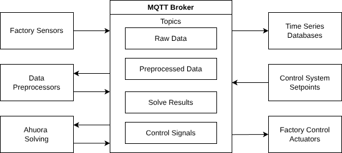

On a high level, a DT gets data from sensors, converts it into a format acceptable by a physical or machine learning model, which is used to predict behaviours on the data. This data may then be converted into actionable insights that provide value.

I have learned a lot about what this looks like in practice from [[case-studies.lab-heat-pump]]. You tend to have a bunch of data from a bunch of different sources, using different protocols and formats etc. You pretty much just accept this, because there's no chance that all your sensors are going to give data in the same way. You also might have multiple different models, that may or may not depend on each other, and multiple different insights or ways of observing your results.

It ends up that you have some sort of data streaming system that ends up forming the backbone of your digital twin, allowing anything that needs data to get it, and anything that provides data to make it accessible.

Event driven architectures map pretty decently to this. Kinda makes sense to get something like MQTT and just dump everything into there as separate topics. Then, different applications can subscribe to whatever topics they need.

This is pretty good, but seems to be missing one thing that is pretty key for getting things to work: replayability. There are a couple of ways to solve this:

- Mqtt event recorders, which allow you to subscribe to and record events. You could use existing ones or use something like Telegraf to write everything to a database, and then figure out how to replay it later.
- Use Kafka (an event streaming platform what is also built for historical access as well) instead.

Both are valid options. [Kafka](https://kafka.apache.org/quickstart/) is really good, really robust, but a lot bigger and more complex - it's practically an operating system. Then there's stuff like Confluent which builds on top of kafka to make it more accessible - introducing things like the [Schema Registry](https://docs.confluent.io/platform/current/schema-registry/index.html) or alternatives like [RedPanda](https://www.redpanda.com/compare/redpanda-vs-kafka) which is slightly more modern and performant than kafka.

An alternative to the schema registry would be to use something like [AsyncAPI](https://www.asyncapi.com/docs/tutorials/getting-started/hello-world) to define your schema - though that may not give as good support for schema migration as you update things.

# What do I care about in a DT data streaming platform?

- Ability to get data from any source, and quickly add or remove sources
- Ability to get historical data or live data easily (also called replayability, or store & forward, or simply could be implemented throug a custom database)
- Event driven
- Strongly typed (ideally with type migration too)- easy to generate SDKs for whatever language or platform is needed.
- Able to check into Version Control (ideally version data/type migration, think protobuf)
- Decent performance
- Simple, unopinionated

OPC can kinda do this, but it is not as event based (though there is OPC pubSub) and it is quite heavy. I'm generally in favor of more lightweight tools. I'm also not sure how sold I am on the ontologies that OPC-UA provides: big specification documents aren't as good as libraries of types for me. maybe libraries of types do exist though. I generally find there's something that you always want to do that's a bit different and doesn't fit into an ontology very well.

To be honest, redpanda or kafka/confluent seem to fit the requirements pretty well. Kinda annoying for me, as I'm not sure what this leaves me to add - probably I can focus on delivering novelty in the following areas:
- the simulation methods and regression methods
- a more formal way of how to use kafka (how to integrate it with sensor data, SCADA systems, simulation platforms, control systems, process historians)
- the interaction between the simulation programs and the data streaming platform

## other things that are kind of important

but to me these are just naturally important, like pretty easy to implement and pretty much everything should have anyway

- Security (I think the simplest way is just wrap everything in a vpn like wireguard or tailscale)
- An ontology? I don't know how important these are, but OPC has specific confgiruations for many types of devices that can make devices interoperable with the same systems. As an alternative MQTT is often used with Unified Namespace Systems (UNS) which defines how topic names should be so that you can access all your data in the same format. This could be really useful, or might not be. I'm always reluctant as what if you have something which doesn't fit the ontology? however it may be a useful view of the data.
- Monitoring - Just forward stuff to grafana or whatever
- Robustness/fallback strategies - this could be implemented in the application layer, or in some lower network layer. though some such as mqtt have this built in. Additionally, individual control systems can have fallbacks too, e.g valves could be set to fail-open or fail-closed.

# Other resources

[Building a robust MQtt architecture to scale across dozens of sites](https://www.youtube.com/watch?v=XORNY2gTl3o)

[Architecting Scalable IoT systems with MQTT and Kafka](https://www.youtube.com/watch?v=-5duMAuleJA)

and probably a hundred others
