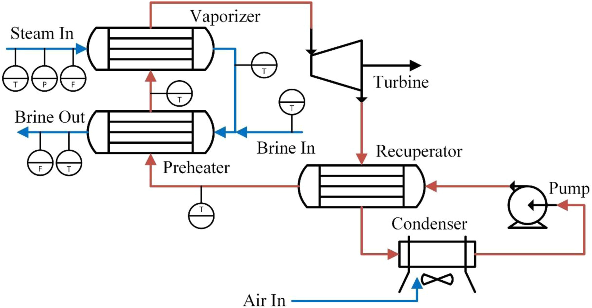

## Objective

The objective of modelling the geothermal process in [I. Severinsen's thesis](https://researchspace.auckland.ac.nz/items/32cb8003-2fa9-45cf-9faa-51fada7fba09) : "Efficient, dynamic, digital twin models of process unit operations using modern regression" was to potentially create an autonomus factory, that could operate without any (much) need for human oversight. However, as discussed in my case studies in my [[proposal.review]], there are lots of others - predicting future conditions, choosing optimal operating conditions, scheduling, or finding potential retrofit solutions. 

## Modelling Methods

Some ideas I have from looking at the flowsheet and the [available data](https://github.com/bertkdowns/geothermal/blob/8c0d44fda6c06c2b3917d9aea55e45916a2a4675/t0_sklearn/other_pairplots.ipynb):

### 1. Dump everything in ML models

We could take the data, remove one column, and train a model to predict it based on the others. Then we could repeat with a different column selected each time. This could maybe be used for detecting drift or unexpected behaviou - when you get live data from the geothermal plant and chuck it into the ML models, the values each model predicts should be very similar to the true values. Simply by looking at how far off each predicted value is to the true value, we could get a statistical idea of how likely this is to be what's expected.

### 2. Model everything in pure IDAES, using parameter estimation

The flowsheet fluids are steam and brine, which is basically water (that's the best approximation if you don't have a specific property package for it), and butane (I think) for the motive fluid. We can model 1D heat exchangers or approximate as a 0D heat exchanger, 

### 3. Model a ML model for each unit operation and try get them to work together

### 4. Do a hybrid approach.

## Notes to write up

most problems/differences between plants are in the dynamics
- runs all the tiem but temperature changes
- turn on and off all the time for cleaning
- always the same 

vaporaiser motive fluid - change the level to change the amount of heat that can transfer

The vaporiser model is sus if you have static values for U and A becausee it depends a lot on where the fluid is boiling, bubbling, etc.

For parameter estimation, calculate the heat transfer coeffficients across the length of the HX, by using first principles (the equations account for thickness of wall, shape of pipe, width of pipe, types of fluids, phase, etc). Then, we use parameter estimation to figure out if we scale those numbers up or down to better reflect the actual performance - a multiplier to multiply each sections htc by.  Table 4.1 in isaac's thesis

off spec models e.g Turbine

Hybrid model:
Serial - addition - learn the residuals
Parallel - run both and average the output
Kernel density estimate - to give you a probability of whether the model is that good or not.

Dropout regularisation - drop the features that aren't that important

Full ML - 

Biggest problems - how much power the turbine is making, and brine outlet temperature.

Goal - autonomous plant - able to go outside of the feature range

you can find flow from the pump work

