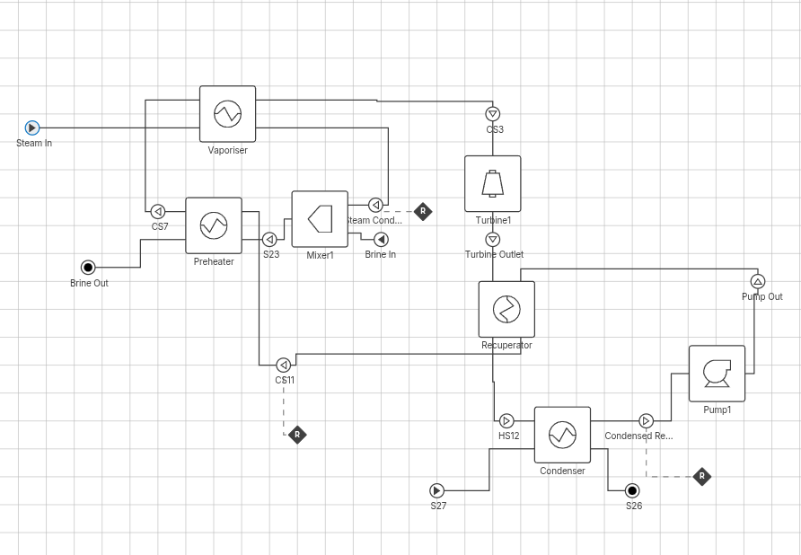
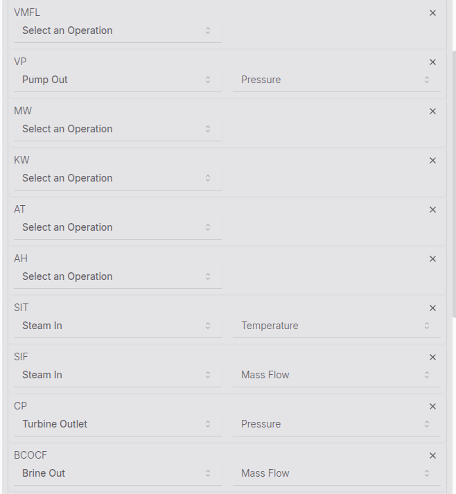

Initially we have these things connected: 

Main things to note:

- these are the most important values to get a decent model. The other ones don't matter as much. some of them can be used for validation.
- The working fluid is pentane, but for now I'm using butane as helmholtz pentane is not supported yet.

Initialising with heat exhangers can be frustrating sometimes. Usually setting temperatures instead of heat transfer coefficients helps as it allows the heat exchangers to dynamically size. you can also increase the flow rates on streams that arent so connected (e.g air stream) to make sure there is enough heat to actually reach those temperatures.

Flow rates in the data are in Tonnes/hour, temperature is in degrees celcius, and pressure is in bar.

