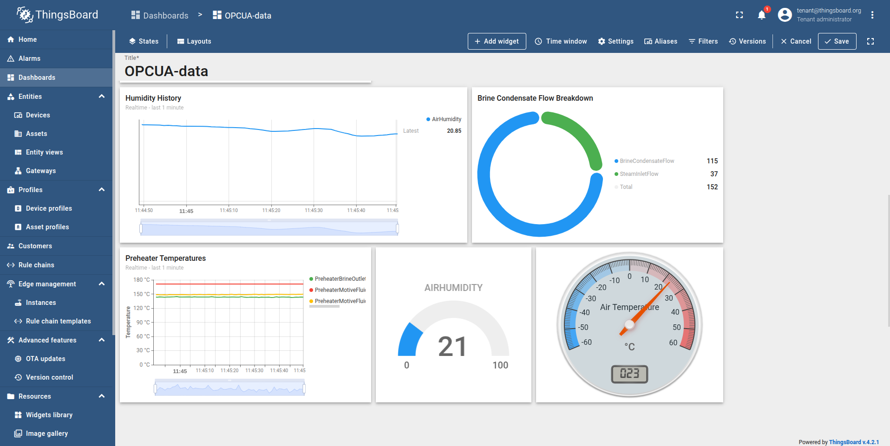

In my repository at [https://github.com/bertkdowns/geothermal](https://github.com/bertkdowns/geothermal), I have setup an opc-ua server that loads the geothermal data and gradually updates properties every couple of seconds, so you can see in real-time what is happening. From my review and discussion in [[ahuora.live-wishlist]] and [[ahuora.live-data]], OPC-UA is basically standard so it's the best place to start. 

Real factories have lots of dashboards and process views on all their screens to tell them what's going on. This is called a SCADA (Supervisory Control and Data Aquisition) system. Visualising results is important, and one of the questions we have had is "what do we do with the results from a real-time version of the ahuora platform"?

 [[ahuora.live-wishlist]] discussed the concept of a solving system that is "OPC-in, OPC-out". So the simple answer to that question is "Put the results back in an OPC server" (or whatever other database it came from). Then, the SCADA system can pull those results from the OPC server the same way as it pulls everything  else from the OPC server. You can show the results of your calculations, predicted optimal conditions, etc, right beside your existing factory dashboards.

## But now we're relying on an external data mangement platform, and an external visualisation platform. Isn't that bad? Shouldn't the ahuora platform do everything?

When you have a task that you want to do, it's generally better to cooperate with other people than it is to dominate or compete with everyone else. 

It'd be very hard to build a better, more full-featured data management platform, visualisation platform, and analysis platform, than already exists out there. "Integrated" does not mean "first-party", it means "seamlessly working together".  We should focus on the things that add value, not just recreating existing tools.

## So what are we adding? aren't we just another equation oriented solver? just another simulation platform, another DWSIM or Hysys?

We're adding the stuff in I. Severinsen's thesis discussed in [[digital-twins]]. There's a lot of in-between stuff that needs to be done to clean data, ensure it's reliable, figure out which properties to map and which to not map, estimate properties like fouling based on inaccuracies across solves, automatically build surrogates when needed, evaluate the performance of surrogates vs first principles, detect anomalies and certainties, etc.

The other thing we could add is the virtualisation layer. Why should you only be able to use your scada systems on the plant? Could we make a version of the platform that emulates a real plant, so when you adjust controls on your scada system, it adjusts properties in our virtual ahuora "simulated plant" so we can play around with it in the same way? Could be good for testing what could happen in different situations. However, that might be a different project.

*From this context, the fundamental question is* ***What is the easiest way for people to prepare live data to be used in real-time solving?***

