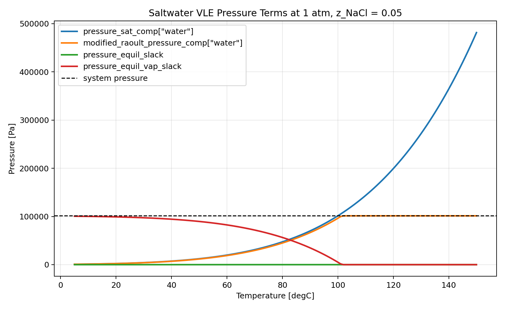
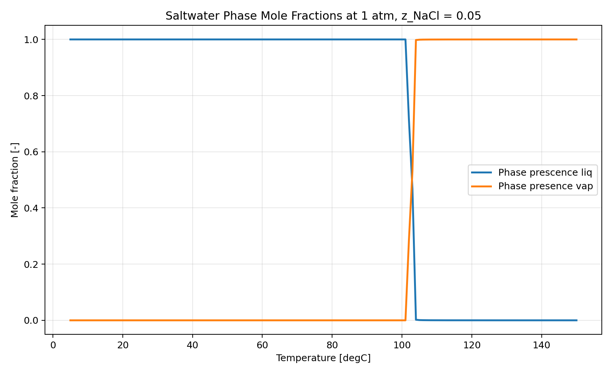
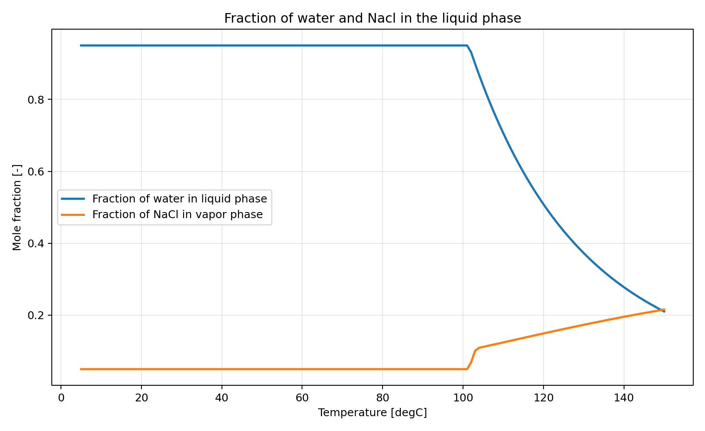

The [crystalliser unit model](https://watertap.readthedocs.io/en/latest/technical_reference/unit_models/crystallizer_0D.html) in watertap works pretty well, but there's a few things to know:

- There's a couple of constants that are used internally that you don't really need. it's okay to fix them to the default values:

```python
crystallizer.crystal_growth_rate.fix()
crystallizer.souders_brown_constant.fix()
crystallizer.crystal_median_length.fix()
```

- The bounds on the crystalliser are quite tight, and don't work well with larger flows. To be honest, you probably won't have larger flows, but it is frustrating if you are testing with random numbers and it fails even though the model is solvable. but you can debug those with the idaes Diagnostics toobox `dt.display_variables_near_bounds()` and relax them:

```python
crystallizer.height_crystallizer.setub(300) # was 25, doesn't work for big ones?
crystallizer.height_slurry.setub(300) # was 25, doesn't work for big ones?
crystallizer.diameter_crystallizer.setub(300) # was 25, doesn't work for big ones?
crystallizer.magma_circulation_flow_vol.setub(1000) # was 100, doesn't work for large crystallizers
crystallizer.work_mechanical.setub(500_000_000) # was 5000_000, doesn't work for large crystallizers
```

# Version 1

[Accessible at WaterTap](https://watertap.readthedocs.io/en/1.6.0/technical_reference/unit_models/crystallizer_0D.html)

This crystalliser uses it's own special property package, which has the following state variables:

```
Temperature
Pressure
flow_mass_phase_comp[Vap,H2O]
flow_mass_phase_comp[Liq,H2O]
flow_mass_phase_comp[Liq,NaCl]
flow_mass_phase_comp[Sol,NaCl]
```
This is a FpcTP formulation. 

The crystalliser does a lot of work, the property package doesn't do VLE and LLE calculations, which can cause problems in some unit operations that expect that.

This leads to degrees of freedom like the following variables in a splitter:

```
Independent Block 1:

    Variables:

        fs.c4_purge.outlet_2_state[0.0].flow_mass_phase_comp[Vap,H2O]
        fs.c4_purge.outlet_2_state[0.0].flow_mass_phase_comp[Liq,H2O]

    Constraints:

        fs.c4_purge.material_splitting_eqn[0.0,outlet_2,H2O]

Independent Block 2:

    Variables:

        fs.c4_purge.outlet_2_state[0.0].flow_mass_phase_comp[Sol,NaCl]
        fs.c4_purge.outlet_2_state[0.0].flow_mass_phase_comp[Liq,NaCl]

    Constraints:

        fs.c4_purge.material_splitting_eqn[0.0,outlet_2,NaCl]
```

The splitter does not know how much of each phase goes to the outlet. By default, it writes constraints to split the amount of salt going to each outlet, and the amount of water going to each outlet - but it doesn't say what phase that salt should be in. 

This can be fixed with setting the splitter/heater/unit op to `material_balance_type="componentPhase"`. This means that it maintains the amount of each phase for both salt and water. This adds 2 extra constraints which fully defines the system.

However, this creates the balance that the amount of material in each phase into the heater is the same as the amount of material in each phase out of the heater - i.e there is no phase change. This doesn't work when you're trying to e.g boil water, as it will just superheat the liquid and it will never evaporate.

# Version 2: VLE on the Property Package

Accessible at commit [d4acbfce8b852ed0beb15ba23d1b0cfa86e1562b](https://github.com/waikato-ahuora-smart-energy-systems/Ahuora-Adaptive-Digital-Twin-Platform/pull/1997/changes/d4acbfce8b852ed0beb15ba23d1b0cfa86e1562b)

Ben created an updated crystalliser model which has VLE and SLE calculations on the property package. The same state variables are used. In this model, phase equilibrium calculations are performed on an intermediate state block before splitting the liquid and vapor up, and then the amount of liquid and vapor in each outlet for each phase is fixed exactly. 
This model does not always have a phase equilibrium though, as the standard material_balance_type is still componentPhase and no phase equilibrium was calculated by default. This meant that a heater could not boil water, and only superheat.

The fix is to set the heater to `has_phase_equilibrium=true`. This means that the heater passes `has_phase_equilibrium=true` to the outlet property package when it is built. Then, you set `material_balance_type=component` and the phase equilibrium calculations decide how much of each phase is present (the ratio of liquid to vapor, and dissolved salt to solid salt). The property package uses the VLE and SLE calculations to figure out the per-phase balance of each from component from the total amount fo each component.

Before building the crystalliser we didn't have to worry about setting has_phase_equilibrium=true, as the other property packages use FTPx so an equilibrium is always calculated as phase information is not passed between arcs anyway.

Finished at [53da4de6623c1cff1dbbfbd778165fb77e18b906](https://github.com/waikato-ahuora-smart-energy-systems/Ahuora-Adaptive-Digital-Twin-Platform/pull/1997)

# Version 3

(https://github.com/waikato-ahuora-smart-energy-systems/Ahuora-Adaptive-Digital-Twin-Platform/pull/2000)

I think using FpcTP is a good formulation as it limits the number of phase equilibium calculations. However, currently we specify FTPx in the platform, and switching that to FpcTP will require adding feed blocks to the inlets to calculate the initial phase equilibrium. Additionally, not all unit operations support setting has_phase_equilibrium on the outlets, so the fix that worked for the heater will not work for everything.

So instead, I updated the formulation's default material_balance type to component instead of componentPhase, and made it always calculate the phase equilibrium the same as everything else. This makes it more similar to the existing FTPx property packages, and works a lot nicer. However, as the crystalliser was built with the idea of disabling phase equilibrium, I also had to update the crystallizer model so that phase equilibrium could be calculated on each of the outlets. This was done by getting rid of the central phase_equilibrium block, and only constraining that there was no solid or liquid in the vapor outlet, and no vapor in the liquid outlet. The phase equilibrium for the salt vle in the vapor outlet thus is still present but irrelevant, and the vles for the water determined how much went to each outlet.

However, this still has some problems with solving - if the model is initialised outside the VLE region, the complementary goes to zero and the value of the slack variable doesn't matter - so it solves at a invalid state.


# Version 4

Commit [da762d7fba40454bd71b9f29e03f3985e5e10548](https://github.com/waikato-ahuora-smart-energy-systems/Ahuora-Adaptive-Digital-Twin-Platform/pull/2006)

There were some reliability issues with the previous formulation. Sometimes, when solving a state where the water was obviously liquid (e.g 1atm and 5°C) we would get a vapor fraction of 1.

To understand why, I made a rough graph of what the different slack variables and values looked like over a temperature range. 


I started off by assuming that the liquid phase fraction should be 1 below the Vapor-Liquid-Equilibrium (VLE), and zero above. The inverse should then be true for the vapor phase fraction.

The saturation pressure is calculated by the [Antoine Equation](https://en.wikipedia.org/wiki/Antoine_equation), and [increases porportional to temperature](https://en.wikipedia.org/wiki/Vapour_pressure_of_water). It's not truly linear but the main thing is that the gradient descent solver always knows which way to go (it's convex, up is always up and down is always down.)

The slack variables make everything more confusing. They are constrained by different parts of the system at different times. 

In the VLE, the `rule_vle_complementarity` constraint forces the slack to be zero.

```
b.phase_presence["Liq"]
* b.phase_presence["Vap"]
* b.pressure_equil_slack
/ b.params.pressure_scale_ref
== 0
```

`pressure_scale_ref` is a constant so it doesn't affect anything, it's basically a scaling factor for numerical stability.

In the VLE, both the liquid and vapor phases are present, so `b.phase_presence["Liq"] * b.phase_presence["Vap"]` is nonzero. For this equation to be true, this means that `pressure_equil_slack` must therefore be zero.

The `pressure_equil_slack` is also used in this equation: 

```b.pressure_equil_slack == b.pressure - b.modified_raoult_pressure_comp["water"]```

When the `rule_vle_complementarity` forces the slack to be zero, this means that `modified_raoult_pressure_comp` must be equal to the system pressure. When we are not in the VLE region, the complementarity has little effect on the slack variable, so it takes on the difference between the system pressure and the value of `b.modified_raoult_pressure_comp["water"]`.

Now we inspect the definition of `modified_raoult_pressure_comp`.

It is only defined for water, and is defined as:

```
modified_raoult_pressure_comp ==
b.mole_frac_phase_comp["Liq", "water"]
* b.activity_coeff_phase_comp["Liq", "water"]
* b.pressure_sat_comp["water"]
```

This property package has been set up to allow an activity coefficient to be calculated to better represent the system, but this is mostly a constant or little-varying value. We have hardcoded the activity coefficient to be 1, so it makes no impact on the equations.

In the liquid phase, mole_frac_phase_comp is approximately 1 as well. This means modified_raoult_pressure_comp is approximately equal to the the saturation pressure of water. 

in the vapor phase, mole_frac_phase_comp["Liq","water"] is approximately zero. this overpowers the effect of pressure_sat_comp so modified_raoult_pressure_comp is approximately zero as well.

This is a cause for concern - the gradient of both the slack variables and the modified raoult's law of pressure switches from positive to negative around the VLE. This means that 1) the solver may move in the wrong direction to better satisfy a constraint (e.g further into the vapor phase region when it should be moving further into the liquid phase region) and 2) that there may be multiple solutions for the same temperature and pressure (A vapor fraction of zero, or a vapor fraction of 1, at 50 degrees celcius will satisfy raoult's law of pressure and the slack variable.) So we need to reformulate the problem so that we know which solution is which, and so that we have appropriate gradients.

## Our solution

We seperate the slack variable into two slack variables: one for the vapor side and one for the liquid side.

So `rule_vle_complementarity` becomes 

```
b.phase_presence["Liq"]
* b.pressure_equil_slack
/ b.params.pressure_scale_ref
== 0
```

only including the phase presence of the liquid, and not of the gas.

We add a seperate `rule_vle_vap_complementarity` for the gas: 

```
b.phase_presence["Vap"]
* b.pressure_equil_slack
/ b.params.pressure_scale_ref
== 0
```

And then we adjust the pressure slack equation to take into account both of these:

```
b.pressure_equil_vap_slack - b.pressure_equil_slack == b.pressure - b.modified_raoult_pressure_comp["water"]
```

What this does is it means the effect of the slack is split into two, and it is inverted from the liquid to the vapor side. So even though the raoult's law of pressure expression gets smaller on both sides of the vle, the effect of this on the slacks is different whether we are on the liquid or the vapor side. This solves the problem of having two solutions and not knowing which direction to go.


## Evaluating our solution

I wrote a script to solve the property package across a variety of conditions, to see if the slack variables and raoult's pressure law was behaving as I expected.

This showed some interesting trends - it was not behaving as I expected in the pure vapor phase:





The modified raoult's law was forced to be the same as the pressure in the vapor phase, because both slack variables were still zero. I thought this was suprising as the other slack variable should be increasing. However, as raoults law goes down afterwards but the saturation pressure goes up, that would actually make the slack variable negative and we have specified that it must be non-negative. Looking back at the definition of the modified raoult's law, the only thing that can move is the fraction of Water in the liquid phase. Graphing this shows some interesting results:



At low temperatures, 95% of the liquid is water - which makes sense as that is the original ratio that the script solved with. In the VLE region, you see the fraction gradually go higher a bit - this will be because of the effects of boiling off the water, combined with the solid-liquid equilibrium when there is too much salt for it all to be soluble in the water. Then, after the VLE point, the curve starts looking a lot more like the p_sat curve. At this point I think that the ratio of salt to water is basically a slack variable as the liquid phase is effectively empty, and so it adjusts that to satisfy the equation for `b.modified_raoult_pressure_comp["water"]`

However, this isn't really a problem as everything solves fine, to be honest it might just be better than our actual solution. It means we can get rid of the slack variable that is always zero and we only need a slack variable on the liquid side.


## Appendix

Parameter Sweep Script for Version 4:

```python
"""Sweep a single saltwater state block across temperature and plot VLE terms.

This script mirrors the property-package usage in
``test_saltwater_evap_crystallizer.py`` by constructing the saltwater package
through ``build_package(...)`` and then building a single state block with
``build_state_block``. The same state block is re-solved across a temperature
range at fixed pressure and overall composition.

Outputs
-------
By default the script writes:
* ``saltwater_vle_sweep.csv``
* ``saltwater_vle_mole_fractions.png``
* ``saltwater_vle_pressures.png``

into ``backend/ahuora-builder/src/ahuora_builder/custom/salt/outputs``.
"""

from __future__ import annotations

import argparse
import csv
import os
import sys
from pathlib import Path

os.environ.setdefault("MPLCONFIGDIR", "/tmp/matplotlib")

import matplotlib

matplotlib.use("Agg")
import matplotlib.pyplot as plt
import pyomo.environ as pyo
from idaes.core import FlowsheetBlock
from idaes.core.solvers import get_solver


REPO_ROOT = Path(__file__).resolve().parents[6]
COMPOUNDS_ROOT = REPO_ROOT / "backend" / "ahuora-compounds"
if str(COMPOUNDS_ROOT) not in sys.path:
    sys.path.insert(0, str(COMPOUNDS_ROOT))

from ahuora_property_packages.build_package import build_package


def build_model():
    m = pyo.ConcreteModel()
    m.fs = FlowsheetBlock(dynamic=False)
    m.fs.props = build_package("saltwater", ["water", "NaCl"], [])
    m.fs.state = m.fs.props.build_state_block([0], defined_state=True)

    s = m.fs.state[0]
    s.flow_mol.fix(1.0)
    s.mole_frac_comp["water"].fix(0.95)
    s.mole_frac_comp["NaCl"].fix(0.05)
    s.pressure.fix(101325.0)
    s.temperature.fix(298.15)

    water_mass = pyo.value(s.flow_mol * s.mole_frac_comp["water"] * s.params.mw_comp["water"])
    nacl_mass = pyo.value(s.flow_mol * s.mole_frac_comp["NaCl"] * s.params.mw_comp["NaCl"])

    s.flow_mass_phase_comp["Liq", "water"].set_value(max(water_mass, 1e-6))
    s.flow_mass_phase_comp["Liq", "NaCl"].set_value(max(nacl_mass, 1e-6))
    s.flow_mass_phase_comp["Vap", "water"].set_value(1e-6)
    s.flow_mass_phase_comp["Sol", "NaCl"].set_value(1e-6)

    return m


def solve_temperature_sweep(
    m,
    temp_start_c: float,
    temp_end_c: float,
    temp_step_c: float,
):
    s = m.fs.state[0]
    solver = get_solver("ipopt")

    rows = []
    n_steps = int(round((temp_end_c - temp_start_c) / temp_step_c))
    temperatures_c = [temp_start_c + i * temp_step_c for i in range(n_steps + 1)]

    for temp_c in temperatures_c:
        s.temperature.fix(temp_c + 273.15)
        s._set_sensible_initial_guesses()
        results = solver.solve(m, tee=False)
        pyo.assert_optimal_termination(results)

        rows.append(
            {
                "temperature_C": temp_c,
                "temperature_K": pyo.value(s.temperature),
                "phase_presence_liq": pyo.value(s.phas["Liq","water"]),
                "phase_presence_vap": pyo.value(s.mole_frac_phase_comp["Liq","NaCl"]),
                "pressure_sat_water_Pa": pyo.value(s.pressure_sat_comp["water"]),
                "pressure_equil_slack_Pa": pyo.value(s.pressure_equil_slack),
                "pressure_equil_vap_slack_Pa": pyo.value(s.pressure_equil_vap_slack),
                "modified_raoult_pressure_water_Pa": pyo.value(
                    s.modified_raoult_pressure_comp["water"]
                ),
            }
        )

    return rows


def write_csv(rows, output_dir: Path):
    csv_path = output_dir / "saltwater_vle_sweep.csv"
    with csv_path.open("w", newline="") as f:
        writer = csv.DictWriter(f, fieldnames=list(rows[0].keys()))
        writer.writeheader()
        writer.writerows(rows)
    return csv_path


def make_plots(rows, output_dir: Path):
    temperatures_c = [row["temperature_C"] for row in rows]

    fig1, ax1 = plt.subplots(figsize=(9, 5.5))
    ax1.plot(
        temperatures_c,
        [row["phase_presence_liq"] for row in rows],
        label='Phase prescence liq',
        linewidth=2,
    )
    ax1.plot(
        temperatures_c,
        [row["phase_presence_vap"] for row in rows],
        label='Phase presence vap',
        linewidth=2,
    )
    ax1.set_xlabel("Temperature [degC]")
    ax1.set_ylabel("Mole fraction [-]")
    ax1.set_title("Saltwater Phase Mole Fractions at 1 atm, z_NaCl = 0.05")
    ax1.grid(True, alpha=0.3)
    ax1.legend()
    fig1.tight_layout()
    mole_frac_plot_path = output_dir / "saltwater_vle_mole_fractions.png"
    fig1.savefig(mole_frac_plot_path, dpi=180)
    plt.close(fig1)

    fig2, ax2 = plt.subplots(figsize=(9, 5.5))
    ax2.plot(
        temperatures_c,
        [row["pressure_sat_water_Pa"] for row in rows],
        label='pressure_sat_comp["water"]',
        linewidth=2,
    )
    ax2.plot(
        temperatures_c,
        [row["modified_raoult_pressure_water_Pa"] for row in rows],
        label='modified_raoult_pressure_comp["water"]',
        linewidth=2,
    )
    ax2.plot(
        temperatures_c,
        [row["pressure_equil_slack_Pa"] for row in rows],
        label="pressure_equil_slack",
        linewidth=2,
    )
    ax2.plot(
        temperatures_c,
        [row["pressure_equil_vap_slack_Pa"] for row in rows],
        label="pressure_equil_vap_slack",
        linewidth=2,
    )
    ax2.axhline(101325.0, color="black", linestyle="--", linewidth=1.2, label="system pressure")
    ax2.set_xlabel("Temperature [degC]")
    ax2.set_ylabel("Pressure [Pa]")
    ax2.set_title("Saltwater VLE Pressure Terms at 1 atm, z_NaCl = 0.05")
    ax2.grid(True, alpha=0.3)
    ax2.legend()
    fig2.tight_layout()
    pressure_plot_path = output_dir / "saltwater_vle_pressures.png"
    fig2.savefig(pressure_plot_path, dpi=180)
    plt.close(fig2)

    return mole_frac_plot_path, pressure_plot_path


def parse_args():
    parser = argparse.ArgumentParser()
    parser.add_argument("--temp-start-c", type=float, default=5.0)
    parser.add_argument("--temp-end-c", type=float, default=150.0)
    parser.add_argument("--temp-step-c", type=float, default=1.0)
    parser.add_argument(
        "--output-dir",
        type=Path,
        default=Path(__file__).resolve().parent / "outputs",
    )
    return parser.parse_args()


def main():
    args = parse_args()
    if args.temp_step_c <= 0:
        raise ValueError("--temp-step-c must be positive.")
    args.output_dir.mkdir(parents=True, exist_ok=True)

    model = build_model()
    rows = solve_temperature_sweep(
        model,
        temp_start_c=args.temp_start_c,
        temp_end_c=args.temp_end_c,
        temp_step_c=args.temp_step_c,
    )
    csv_path = write_csv(rows, args.output_dir)
    mole_frac_plot_path, pressure_plot_path = make_plots(rows, args.output_dir)

    print(f"Wrote {len(rows)} sweep points")
    print(f"CSV: {csv_path}")
    print(f"Mole fraction plot: {mole_frac_plot_path}")
    print(f"Pressure plot: {pressure_plot_path}")


if __name__ == "__main__":
    main()

```