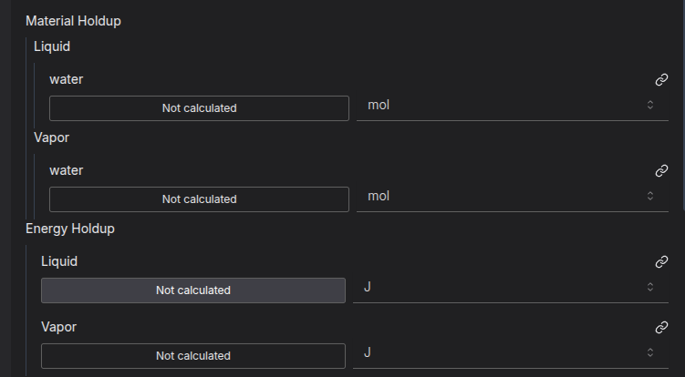

# What is differential algebraic equations?

It's basically the way you learned how to do differentiation before you learned calculus - finding the difference between numbers in a sequence. It's a finite approximation of the derivative.


The algebraic equations come from the constraints to link them together. You add constraints that each number equals the previous plus the "accumulation" - so 1 + = 2, 2 + 1 = 3, 3 + 0 = 3, and so on.

Pyomo.DAE creates an indexedVar for the pattern (we'll just call it the tank level in this context), and a derivativeVar for the change (accumulation). Both of these are indexed by time, let's say we're going from t = 0 to t = 6


Time         | 0 | 1 | 2 | 3 | 4 | 5 | 6 
------------ | - | - | - | - | - | - | -
Level        | 1 | 2 | 3 | 3 | 4 | 3 | 2 
Accumulation | X | 1 | 1 | 0 | 1 |-1 |-1

Then constraints are added that `Level[t] = Level[t-1] + Accumulation[t]`

However, notice the X at `t=0` for accumulation. Since we don't know the level before this point, we don't know what the accumulation is. so this has to be specified as the initial value.

A common assumption is that the accumulation is 0 at the initial condition, i.e steady state.

Time         | 0 | 1 | 2 | 3 | 4 | 5 | 6 
------------ | - | - | - | - | - | - | -
Level        | 1 | 2 | 3 | 3 | 4 | 3 | 2 
Accumulation | 0 | 1 | 1 | 0 | 1 |-1 |-1

Because of the the way the algebraic system works, you need to fix either level or accumulation, and an initial condition for the other one. So this will fully define your system:

Time         | 0 | 1 | 2 | 3 | 4 | 5 | 6 
------------ | - | - | - | - | - | - | -
Level        | 1 | 2 | 3 | 3 | 4 | 3 | 2 
Accumulation | 0 |   |   |   |   |   |  

As you can calculate all the accumulation in between. Alternatively, this will also work:

Time         | 0 | 1 | 2 | 3 | 4 | 5 | 6 
------------ | - | - | - | - | - | - | -
Level        | 1 |   |   |   |   |   |   
Accumulation | 0 | 1 | 1 | 0 | 1 |-1 |-1

I.e you can calculate the level change from the accumulation. note that you still need the initial level^[you could also specify the final level instead, or at any other point in time, but initial is most common.] as a point to start from, in calculus terms, to calculate your [plus c](https://en.wikipedia.org/wiki/Constant_of_integration). So the DAE system can do integration for you. The other nice thing is that the properties of algebraic systems and number of degrees of freedom are preserved, its the same either way. 

# Where it gets more confusing - applying it to a tank in IDAES

In idaes, you aren't just worried about the tank's level - you are also worried about its composition and energy. Thus, you end up with a lot more properties that you have to worry about.



You need to know how much material there is of each component in each phase. You also need to know how much energy (think heat or enthalpy) there is in each phase. Does your tank have 100 mols of liquid or gas in it? how hot is the gas? how much of that is water?


Fortunately, IDAES has calculations to set the values over time, so you if you know the outlet flow rate, or the level over time, it can figure out how the composition will change etc.

However, it doesn't for initial conditions. And the way these interact can be weird. Especially since the tank can be filling and emptying at the same time. And the numbers for these (mols/s and J/s) are quite abstract from a real world sense - how many joules are in 1kg of water? 

For example, if you set initial energy accumulation to 0, but you have flow accumulation, the only way to make that work is if the initial temperature of the stuff in the tank is really hot - so that the tanks is losing enough energy in the outlet to equal the amount of energy coming in the inlet. 


# A (possibly) better solution.

Since the initial accumulation conditions are hard to specify, particularly for accumulation, I decided to come up with another solution. Remember how at the start, we had more values for Level than for accumulation? so that way we didn't need an initial accumulation. 

I decided to add an extra state block to the IDAES tank model's build method. In this block, you can set the flow and temperature and pressure (it assumes the composition is constant), and the state block can calculate the internal representation in terms of molar and energy hold up per phase and component. Then it adds some extra constraints to link this state block to the initial level and accumulation as though it was time `-1`.


```python
if not self.config.dynamic:
    return # There is no need to add these extra properties.        

self.initial_block = self.config.property_package.build_state_block(
    [0],
    defined_state=True,
)

if len(self.config.property_package.component_list) > 1:

    # We are assuming that the composition does not change at the initial time step. In theory it could, but
    # we can worry about that later.
    @self.Constraint(
        self.config.property_package.component_list,
        doc="Initial composition constraint",
    )
    def initial_composition_constraint(b, j):
        return (
            b.initial_block[0].mole_frac_comp[j]
            == b.control_volume.properties_in[0].mole_frac_comp[j]
        )

# The initial temperature, pressure, and flow amount is set by the user.
self.initial_pressure = Var(initialize=101325, units=pyunit.Pa)
@self.Constraint(doc="Initial pressure constraint")
def initial_pressure_constraint(b):
    return b.initial_block[0].pressure == b.initial_pressure

self.initial_holdup = Var(initialize=300, units=pyunit.mol)
@self.Constraint(doc="Initial flow constraint")
def initial_holdup_mol_constraint(b):
    return (
        b.initial_block[0].flow_mol * pyunit.s == b.initial_holdup
    )  # cancel out the seconds as we are using it for holdup not accumulation.


self.initial_level = Var(initialize=300, units=pyunit.m)
@self.Constraint(doc="Initial level constraint")
def initial_level_constraint(b):
    return b.initial_holdup == b.tank_cross_sect_area * b.initial_level * b.initial_block[0].dens_mol

self.initial_temperature = Var(initialize=300, units=pyunit.K)
@self.Constraint(doc="Initial temperature constraint")
def initial_temperature_constraint(b):
    return b.initial_block[0].temperature == b.initial_temperature

# The temperature, pressure and flow are used to calculate the other properties.
@self.Constraint(
    self.config.property_package.phase_list,
    self.config.property_package.component_list,
    doc="Defining accumulation",
)
def initial_material_conditions_constraint(b, p, j):
    return (
        b.initial_block[0].flow_mol
        * b.initial_block[0].mole_frac_phase_comp[p, j]
        + b.control_volume.material_accumulation[0, p, j]
        == b.control_volume.material_holdup[0, p, j]
    )

@self.Constraint(
    self.config.property_package.phase_list, doc="Defining accumulation"
)
def initial_energy_conditions_constraint(b, p):
    return (
        b.initial_block[0].flow_mol
        * b.initial_block[0].phase_frac[p]
        * b.initial_block[0].enth_mol_phase[p]
        + b.control_volume.energy_accumulation[0, p]
        == b.control_volume.energy_holdup[0, p]
    )
```


The advantage of this is that you can then just set the pressure and temperature, and it can calculate the energy. If you don't want any initial energy or flow accumulation, you can just set it to be the same. 

The other advantage is it works well with our variable replacement system - these are initial values and you can replace these initial values with any other initial value and it'll work.


