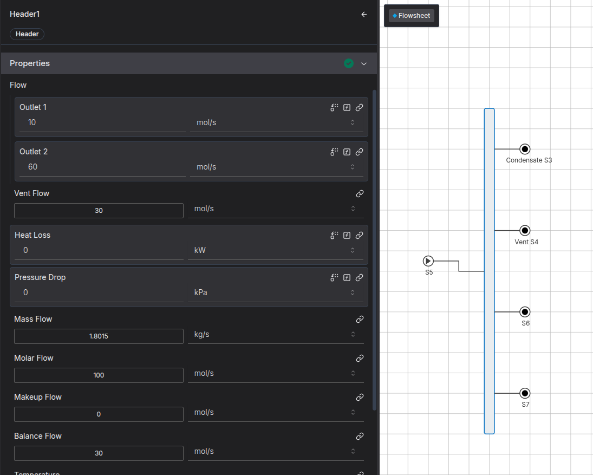

We made a Steam Header unit operation in IDAES:

This is done by combining multiple simple IDAES models into one operation.

## Key components

You can have as many inlets as you like.

There always is a `condensate` outlet, which takes all liquid out of the header. 

You can have as many outlets as you like, and you can set the flow for each outlet.

If there is too much steam, any extra steam will go through the `vent` outlet.

If there is not enough steam, the `makeup_flow_mol` variable will show how much extra steam is required to meet demand.

Some key design choices:

## Makeup

We wanted to make it so that you can specify the flow of each of the outlets, and sufficient flow is always provided. Thus, the arc between the cooler and phase separator does not transfer flow information. Instead, we use a constraint to set the flow of the vent. we use `max(0,balance_flow_mol)` in the idaes unit operation to ensure that the vent is always positive, i.e, if there's more steam in the inlets than is required in the outlets, the rest of it will be vented.

If there is insufficient flow in the inlets (i.e balance flow is negative), the amount of extra steam required is shown in the `makeup_flow_mol` variable.

A common use case is to ensure that there is always sufficient flow in the inlets: in this case you can replace the flow_mol of one of the inlets with the balance_flow_mol, and fix balance_flow_mol to zero. that inlet flow will be calcualted to ensure that the inlets and outlets of the headers always balance.

## Initialisation

Sequential decomposition uses the parent blocks of the ports to figure out the order of initialisation. E.g if there is an inlet and outlet port on the mixer, it will ensure whatever's connected to the inlet of the mixer is initialised first. However, if we make a duplicate port of on the header (that also connected to the splitters state block), sequential decomposition can't tell that anything is connected upstream of the splitter - only upstream of the header. So it might initialise the splitter before any upstream unit operations. E.g with a heater connected to the inlet of the header, we would get weird orders of initialisation such as:

`Order of initialisation: [m.fs.header.mixer, m.fs.heater, m.fs.header, m.fs.header.phase_separator, m.fs.header.splitter]`

Reference variables also must be indexed, and ports are not indexed blocks. So instead of trying to make reference ports on the header, we just decided that you should use the ports inside the individual operations. e.g inlets are connected to `m.fs.header.mixer.inlet_1`, the condensate is at `m.fs.header.phase_separator.condensate_outlet`, and the outlets/vent are at `m.fs.header.splitter.outlet_1`

This made a sensible order or initialisation.

`Order of initialisation: [m.fs.heater, m.fs.header.mixer, m.fs.header.cooler, m.fs.header.phase_separator, m.fs.header.splitter]`

