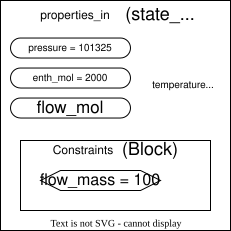

In this example (see the previous section) a constraint is used to define a state block.

State blocks have an initialisation routine, `sb.initialize()`, which is used to figure out good guesses for all the variables in the state block.

More complex state blocks have other variables and other constraints (e.g temperature might be a variable, with a constraint linking temperature and pressure and enthalpy) and so they need to be solved for. Even in the simple helmholtz case, part of the initialization involves leaving all state variables (`flow_mol`, `pressure`, and `enth_mol`) fixed so that the unit operation can solve with those values - even if they aren't the correct values it's a good guess.

The problem arises when we add our custom constraints (e.g our `flow_mass` constraint.) As all the state variables have been fixed by the initialisation, `flow_mol` is already fixed (to some guessed values), and so the `flow_mass` constraint over-defines the system. This leads to a `degrees of freedom` error when solving.

Our solution is a wrapper method for the state block, creating our own custom initialisation routine that doesn't fix flow_mol if a flow_mass constraint is defined. This is done as part of the property_packages repository.

[Example code](https://github.com/waikato-ahuora-smart-energy-systems/PropertyPackages/blob/b2de087ac431c34d17c2f52bc16f5dfb1c0ebc84/property_packages/helmholtz/helmholtz_extended.py)

# Update/continuation: July 2026

In switching from [flow_mol to flow_mass as the state variable in the frontend](https://github.com/waikato-ahuora-smart-energy-systems/Ahuora-Adaptive-Digital-Twin-Platform/pull/2188), I have been able to generalise the process of initialisation for property packages more.

Now, they all use a two step initialisation:

First, they initialise with the normal default values that are coded into the system. This gets it to a known good-quality state. Then, we switch back to using the custom constraints, and re-solve with them.

This is pretty much the same way [pyomo-replace](https://github.com/bertkdowns/pyomo-replace) works, except it is a bit lower level (our replacement logic in the ahuora platform works on a higher level, not inside individual initialisation routines. Potentially we should combine the two.)

However, this approach doesn't have as much information, and it doesnt know exactly what custom constraints replace what state variables. Plus, sometimes you can't calculate the entire block as not everything is fixed - e.g you might have flow_mass fixed so you can calculate flow_mol (the [state variable](https://idaes-pse.readthedocs.io/en/2.4.0/explanations/components/property_package/general/state_definition.html) for flow), but since it's an outlet you don't have temperature and pressure specified. However, we can still solve the part of the system that is fully specified. We added the method `solve_square_subsets` to flexible_state_block.py to do so, getting the square part of the dulmage-mendelson variable and constraint set. A pretty similar thing is possible using the pyomo incidence analysis [strongly connected component solver](https://pyomo.readthedocs.io/en/6.9.1/api/pyomo.contrib.incidence_analysis.scc_solver.html), but we do it ourselves just to have slightly more control over error handling (plus we don't want to use calculate_variable_from_constraint).

