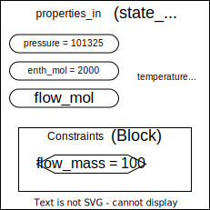

In this example (see the previous section) a constraint is used to define a state block.

State blocks have an initialisation routine, `sb.initialize()`, which is used to figure out good guesses for all the variables in the state block.

More complex state blocks have other variables and other constraints (e.g temperature might be a variable, with a constraint linking temperature and pressure and enthalpy) and so they need to be solved for. Even in the simple helmholtz case, part of the initialization involves leaving all state variables (`flow_mol`, `pressure`, and `enth_mol`) fixed so that the unit operation can solve with those values - even if they aren't the correct values it's a good guess.

The problem arises when we add our custom constraints (e.g our `flow_mass` constraint.) As all the state variables have been fixed by the initialisation, `flow_mol` is already fixed (to some guessed values), and so the `flow_mass` constraint over-defines the system. This leads to a `degrees of freedom` error when solving.

Our solution is a wrapper method for the state block, creating our own custom initialisation routine that doesn't fix flow_mol if a flow_mass constraint is defined. This is done as part of the property_packages repository.

[Example code](https://github.com/waikato-ahuora-smart-energy-systems/PropertyPackages/blob/b2de087ac431c34d17c2f52bc16f5dfb1c0ebc84/property_packages/helmholtz/helmholtz_extended.py)
