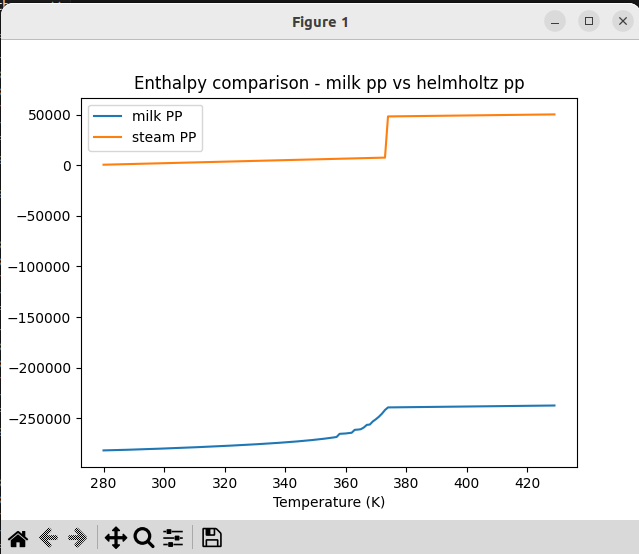
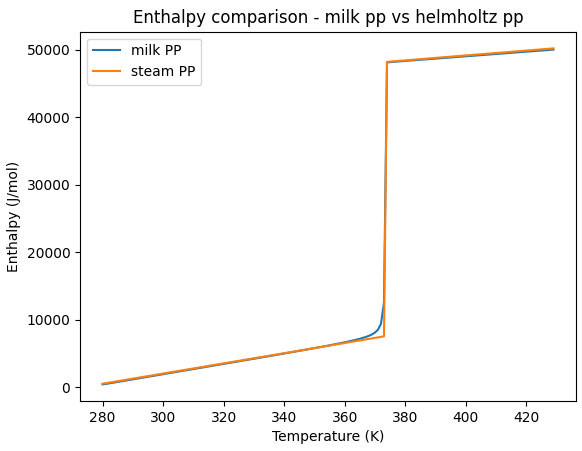

Enthalpy is a relative term. In order for different property packages to be compatible, they need to have the same reference enthalpy. 

An example of a similar concept is temperature. Celcius and Kelvin have the same scale (if you heat water up by 1 degree Celcius, that's the same as saying you have heated water up by 1 degree Kelvin) but different reference points (1 degree Celcius is 276.15 degrees kelvin)

This problem also happens in property packages. If I have a Helmholtz property package an the enthalpy of water is 100 j/mol, it's at around 0 degrees celcius at atmospheric pressure. However, in a diferent property package an enthalpy of 100 j/mol might be 25 degrees celcius at atmospheric pressure. That's cos the reference point of IWAPS95 is the triple point of water (0.01 degrees C at 611 pa)  while another one might use room temperature and pressure.

Our milk property package and our water property package have different reference enthalpies, as shown by [this script](https://github.com/bertkdowns/direct_steam_injection/commit/03b8e5b49d2f3e4295469736122a82c11ebd31f7) (you can checkout at this commit and run it)

The script first prints the enthalpies at 300 kelvin and 1 atm, and then the enthalpies at 400 kelvin 1 atm.


```
python find_reference_enthalpy.py 
milk enth_mol -281870.6061410932
helm enth_mol 2029.5082087775857
difference to add to milk: 283900.11434987077
--------------- vapor version ----------
milk enth_mol -238374.21957664166
helm enth_mol 49187.111188126015
difference to add to milk: 287561.33076476766
```

As you can see, there is a difference between them of ~283900. However, at the higher temperature, this difference increases to 287561. This is a difference of 3000 J/mol. Since it takes 75 J/mol to heat 1 mol of liquid water at 1atm 1 degree, that's kinda a lot.

However, if I modify the temperature to 350 kelvin, the difference in enthalpies decreases to 276482 J/mol. thats a "difference between the differences" of -7418, so it seems to vary quite a bit. Which is frustrating, because a reference enthalpy is a constant value you're supposed to add, and so that makes it hard to determine the constant to add.

# Solution

To better understand what was going on, I tried to graph the result. 



As you can see, the milk property package and the helmholtz/steam property package look quite different. Helmholtz has a sharp line at 100 degrees celcius, where everything vaporises. Milk doesn't have that at all- it slowly vaporises.

It turns out that this was because in the previous example we had the amount of water set to 0.999999999 - which is too high, and the formulation starts to break. Dropping off a couple of those nines turned out to give a much better result. Then, we just had to adjust the reference enthalpy of both the liquid and vapor in the milk_config file. (note that the reference enthalpy of vapor is actually the H parameter in NIST, and you have to put in a negative value for some reason - otherwise you'll end up with an inverted graph.)



The updated version can be found [here](https://github.com/bertkdowns/direct_steam_injection/commit/1fb58b19b1be2e148b07f723d13f068df6ebb67a).

Using this enables the [[idaes.translator]] block to constrain enthalpy instead of temperature, which works a lot better.
