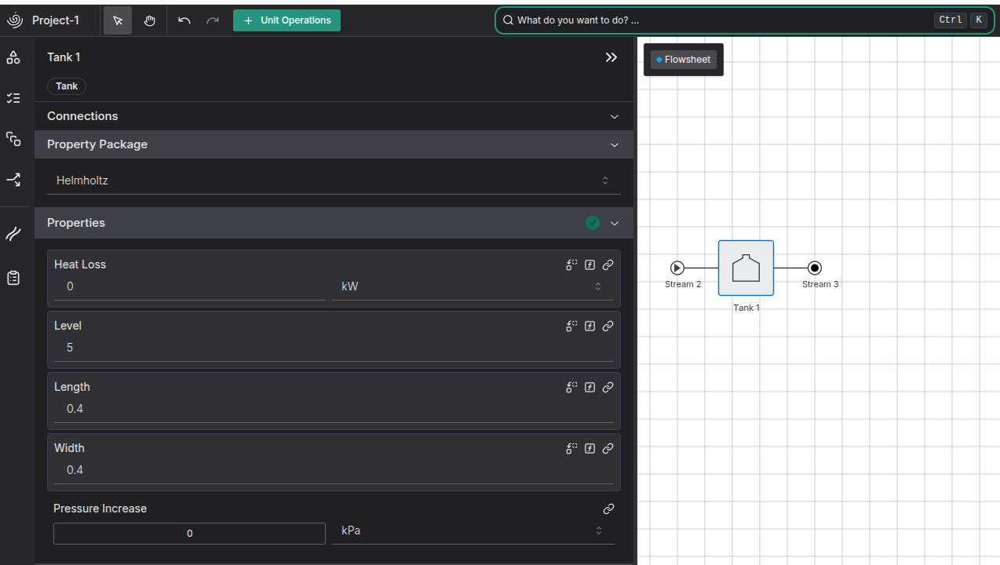
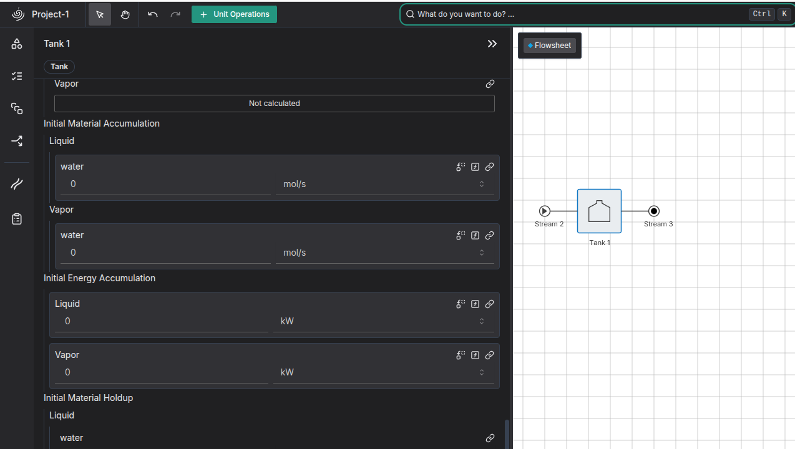

# Background

We are trying to get dynamics to work, and we want to model a tank. The key thing a tank models is [pressure head](https://en.wikipedia.org/wiki/Pressure_head) (the pressure increase at the outlet from the weight water/fluid in the tank; if the tank level is higher the pressure at the outlet will be higher).

IDAES has a [Water tank model](https://idaes-pse.readthedocs.io/en/2.5.0/reference_guides/model_libraries/power_generation/unit_models/watertank.html) that can model this, including different shapes of tanks. Even though it is called a Water Tank, it is actually generic and can support any type of liquid.

# Initial implementation

I started by modelling a rectangular tank in the platform. The main properties we needed to specify are the heat loss, level, length, and width. Unfortunately, the IDAES model doesn't have units, so these quantities are in meters even though they are showing as dimensionless.



Initial conditions are also required, as we are trying to do a dynamic simulation. The [IDAES water tank model](https://github.com/IDAES/idaes-pse/blob/6a588c799fbaf00cb1b32b814fcee6ad111bc4c1/idaes/models_extra/power_generation/unit_models/watertank.py#L63) includes a method calles `set_initial_conditions` which fixes the material_accumulation and the  energy accumulation at time 0 to be 0. This basically assumes that the tank is in a steady state at this time, i.e the tank level is not changing.

To make it easier to set these in the platform, I have added a [Custom Tank Model](https://github.com/bertkdowns/model-predictive-control/blob/f9d668584df98d11f077dc179577a986e0b27881/tank_trouble/custom_tank.py) which creates reference variables for the accumulation at time 0, so these can be shown and set seperately in the UI. This is also done for other operations like the dynamic implementation of a heater.



# Debugging

There were some problems with my initial tank model - it was failing to solve. I tried to replicate the tank model in IDAES, but it always did solve - even when I added all the little "tricks" that we do - like [[ahuora.storing-previous-model-state]] and [[idaes.initialisation-with-custom-constraints]] and [[idaes.ph-formulation]].


Eventually, we started debugging which part of initialisation was failing and why. I noticed that the holdup was negative after step 2:

```
initial_material_holdup : Size=2, Index=fs.PP_0._phase_component_set, ReferenceTo=fs.Tank 1_2.control_volume.material_holdup[0, :, :]
Key : Lower : Value : Upper : Fixed : Stale : Domain
('Liq', 'water') : None : -1307.9637371735869 : None : False : False : Reals
('Vap', 'water') : None : 0.25771588480839475 : None : False : False : Reals
initial_energy_holdup : Size=2, Index=fs.PP_0.phase_list, ReferenceTo=fs.Tank 1_2.control_volume.energy_holdup[0, :]
Key : Lower : Value : Upper : Fixed : Stale : Domain
Liq : None : -4931810.894730348 : None : False : False : Reals
Vap : None : 11341.1485952299 : None : False : False : Reals
```

This didn't make sense: how can you have a tank with a negative amount of water in it?
Adding a constraint that the initial material holdup had to be positive solved the problem.

```python
# add_initial_dynamics.py
unit_model.initial_material_holdup.setlb(0)
```

After that, the model solved very quickly.


# Diagnostics toolbox


The IDAES [Model Diagnostics Toolbox](https://idaes-examples.readthedocs.io/en/2.4.0/docs/diagnostics/diagnostics_toolbox_doc.html) also provided some interesting insights as I was trying to debug everything.


```
3 WARNINGS

WARNING: 16 Components with inconsistent units
WARNING: Structural singularity found
Under-Constrained Set: 30 variables, 29 constraints
Over-Constrained Set: 9 variables, 10 constraints
WARNING: Found 15 potential evaluation errors.

------------------------------------------------------------------------------------
2 Cautions

Caution: 24 variables fixed to 0
Caution: 119 unused variables (113 fixed)

------------------------------------------------------------------------------------
Suggested next steps:

display_components_with_inconsistent_units()
display_underconstrained_set()
display_overconstrained_set()
display_potential_evaluation_errors()

====================================================================================
```

I had got the degrees of freedom to zero by a combination of trial and error and reading the docs. But apparently I hadn't done it correctly - one part of the model was over-constrained, and another part of the model was under-constrained. However, the model still solves fine, so not sure how much of a problem it is.


# Over-Constrained Set

```
====================================================================================
Dulmage-Mendelsohn Over-Constrained Set

Independent Block 0:

Variables:

fs.Tank 1_2.control_volume.properties_in[0.0].enth_mol
fs.Tank 1_2.control_volume.material_accumulation[0.0,Liq,water]
fs.Tank 1_2.control_volume.properties_out[0.0].flow_mol
fs.Tank 1_2.control_volume.properties_out[0.0].enth_mol
fs.Tank 1_2.control_volume.properties_out[0.0].pressure
fs.Tank 1_2.control_volume.material_accumulation[0.0,Vap,water]
fs.Tank 1_2.control_volume.energy_accumulation[0.0,Liq]
fs.Tank 1_2.control_volume.energy_accumulation[0.0,Vap]
fs.Tank 1_2.control_volume.deltaP[0.0]

Constraints:

fs.Tank 1_2.control_volume.material_balances[0.0,Liq,water]
fs.Tank 1_2.initial_material_accumulation_constraint[Liq,water]
fs.Tank 1_2.control_volume.material_balances[0.0,Vap,water]
fs.Tank 1_2.control_volume.enthalpy_balances[0.0]
fs.Tank 1_2.control_volume.pressure_balance[0.0]
fs.Tank 1_2.initial_material_accumulation_constraint[Vap,water]
fs.Tank 1_2.initial_energy_accumulation_constraint[Liq]
fs.Tank 1_2.initial_energy_accumulation_constraint[Vap]
fs.Tank 1_2.pressure_change_eqn[0.0]
fs.Tank 1_2.control_volume.properties_in[0.0].constraints.temperature

====================================================================================
```

This is the initial values, so it's saying that we have fixed the initial conditions too much. We are fixing the initial material and energy accumulation. DeltaP and properties_out can be calculated from that.

```
====================================================================================
Dulmage-Mendelsohn Under-Constrained Set

Independent Block 0:

Variables:

fs.Tank 1_2.control_volume.phase_fraction[0.0,Vap]
fs.Tank 1_2.control_volume.phase_fraction[0.0,Liq]
fs.Tank 1_2.control_volume.material_holdup[0.0,Vap,water]
fs.Tank 1_2.control_volume.energy_holdup[0.0,Vap]
fs.Tank 1_2.control_volume.material_holdup[0.0,Liq,water]
fs.Tank 1_2.control_volume.energy_holdup[0.0,Liq]
fs.Tank 1_2.control_volume.material_accumulation[1.0,Vap,water]
fs.Tank 1_2.control_volume.energy_accumulation[1.0,Vap]
fs.Tank 1_2.control_volume.material_accumulation[1.0,Liq,water]
fs.Tank 1_2.control_volume.energy_holdup[1.0,Liq]
fs.Tank 1_2.control_volume.properties_out[1.0].enth_mol
fs.Tank 1_2.control_volume.energy_accumulation[1.0,Liq]
fs.Tank 1_2.control_volume.properties_out[1.0].flow_mol
fs.Tank 1_2.control_volume.phase_fraction[1.0,Liq]
fs.Tank 1_2.control_volume.energy_holdup[2.0,Liq]
fs.Tank 1_2.control_volume.material_holdup[1.0,Liq,water]
fs.Tank 1_2.control_volume.material_holdup[1.0,Vap,water]
fs.Tank 1_2.control_volume.energy_holdup[1.0,Vap]
fs.Tank 1_2.control_volume.phase_fraction[1.0,Vap]
fs.Tank 1_2.control_volume.phase_fraction[2.0,Liq]
fs.Tank 1_2.control_volume.material_accumulation[2.0,Liq,water]
fs.Tank 1_2.control_volume.material_accumulation[2.0,Vap,water]
fs.Tank 1_2.control_volume.energy_accumulation[2.0,Vap]
fs.Tank 1_2.control_volume.phase_fraction[2.0,Vap]
fs.Tank 1_2.control_volume.material_holdup[2.0,Liq,water]
fs.Tank 1_2.control_volume.properties_out[2.0].flow_mol
fs.Tank 1_2.control_volume.properties_out[2.0].enth_mol
fs.Tank 1_2.control_volume.energy_accumulation[2.0,Liq]
fs.Tank 1_2.control_volume.material_holdup[2.0,Vap,water]
fs.Tank 1_2.control_volume.energy_holdup[2.0,Vap]

Constraints:

fs.Tank 1_2.control_volume.sum_of_phase_fractions[0.0]
fs.Tank 1_2.control_volume.material_holdup_calculation[0.0,Vap,water]
fs.Tank 1_2.control_volume.energy_holdup_calculation[0.0,Vap]
fs.Tank 1_2.control_volume.material_holdup_calculation[0.0,Liq,water]
fs.Tank 1_2.control_volume.energy_holdup_calculation[0.0,Liq]
fs.Tank 1_2.control_volume.material_accumulation_disc_eq[1.0,Vap,water]
fs.Tank 1_2.control_volume.energy_accumulation_disc_eq[1.0,Vap]
fs.Tank 1_2.control_volume.material_accumulation_disc_eq[1.0,Liq,water]
fs.Tank 1_2.control_volume.energy_accumulation_disc_eq[1.0,Liq]
fs.Tank 1_2.control_volume.material_balances[1.0,Vap,water]
fs.Tank 1_2.control_volume.enthalpy_balances[1.0]
fs.Tank 1_2.control_volume.material_balances[1.0,Liq,water]
fs.Tank 1_2.control_volume.energy_holdup_calculation[1.0,Liq]
fs.Tank 1_2.control_volume.energy_accumulation_disc_eq[2.0,Liq]
fs.Tank 1_2.control_volume.material_holdup_calculation[1.0,Liq,water]
fs.Tank 1_2.control_volume.material_holdup_calculation[1.0,Vap,water]
fs.Tank 1_2.control_volume.energy_holdup_calculation[1.0,Vap]
fs.Tank 1_2.control_volume.sum_of_phase_fractions[1.0]
fs.Tank 1_2.control_volume.energy_holdup_calculation[2.0,Liq]
fs.Tank 1_2.control_volume.material_accumulation_disc_eq[2.0,Liq,water]
fs.Tank 1_2.control_volume.material_accumulation_disc_eq[2.0,Vap,water]
fs.Tank 1_2.control_volume.energy_accumulation_disc_eq[2.0,Vap]
fs.Tank 1_2.control_volume.sum_of_phase_fractions[2.0]
fs.Tank 1_2.control_volume.material_holdup_calculation[2.0,Liq,water]
fs.Tank 1_2.control_volume.material_balances[2.0,Liq,water]
fs.Tank 1_2.control_volume.material_balances[2.0,Vap,water]
fs.Tank 1_2.control_volume.enthalpy_balances[2.0]
fs.Tank 1_2.control_volume.material_holdup_calculation[2.0,Vap,water]
fs.Tank 1_2.control_volume.energy_holdup_calculation[2.0,Vap]

====================================================================================
====================================================================================
15 WARNINGS

fs.Tank 1_2.pressure_change_eqn[0.0]: Potential division by 0 in 1.0/v_liq_hp_func('water', (kJ/1000/J/fs.PP_0.mw*fs.Tank 1_2.control_volume.properties_in[0.0].enth_mol), (kPa/1000/Pa*fs.Tank 1_2.control_volume.properties_in[0.0].pressure), '/Scratch/PropertyPackages/property_packages/helmholtz/parameters/'); Denominator bounds are (-inf, inf)
fs.Tank 1_2.pressure_change_eqn[1.0]: Potential division by 0 in 1.0/v_liq_hp_func('water', (kJ/1000/J/fs.PP_0.mw*fs.Tank 1_2.control_volume.properties_in[1.0].enth_mol), (kPa/1000/Pa*fs.Tank 1_2.control_volume.properties_in[1.0].pressure), '/Scratch/PropertyPackages/property_packages/helmholtz/parameters/'); Denominator bounds are (-inf, inf)
fs.Tank 1_2.pressure_change_eqn[2.0]: Potential division by 0 in 1.0/v_liq_hp_func('water', (kJ/1000/J/fs.PP_0.mw*fs.Tank 1_2.control_volume.properties_in[2.0].enth_mol), (kPa/1000/Pa*fs.Tank 1_2.control_volume.properties_in[2.0].pressure), '/Scratch/PropertyPackages/property_packages/helmholtz/parameters/'); Denominator bounds are (-inf, inf)
fs.Tank 1_2.control_volume.material_holdup_calculation[0.0,Liq,water]: Potential division by 0 in 1.0/(v_liq_hp_func('water', (kJ/1000/J/fs.PP_0.mw*fs.Tank 1_2.control_volume.properties_out[0.0].enth_mol), (kPa/1000/Pa*fs.Tank 1_2.control_volume.properties_out[0.0].pressure), '/Scratch/PropertyPackages/property_packages/helmholtz/parameters/')*fs.PP_0.mw); Denominator bounds are (-inf, inf)
fs.Tank 1_2.control_volume.material_holdup_calculation[0.0,Vap,water]: Potential division by 0 in 1.0/(v_vap_hp_func('water', (kJ/1000/J/fs.PP_0.mw*fs.Tank 1_2.control_volume.properties_out[0.0].enth_mol), (kPa/1000/Pa*fs.Tank 1_2.control_volume.properties_out[0.0].pressure), '/Scratch/PropertyPackages/property_packages/helmholtz/parameters/')*fs.PP_0.mw); Denominator bounds are (-inf, inf)
fs.Tank 1_2.control_volume.material_holdup_calculation[1.0,Liq,water]: Potential division by 0 in 1.0/(v_liq_hp_func('water', (kJ/1000/J/fs.PP_0.mw*fs.Tank 1_2.control_volume.properties_out[1.0].enth_mol), (kPa/1000/Pa*fs.Tank 1_2.control_volume.properties_out[1.0].pressure), '/Scratch/PropertyPackages/property_packages/helmholtz/parameters/')*fs.PP_0.mw); Denominator bounds are (-inf, inf)
fs.Tank 1_2.control_volume.material_holdup_calculation[1.0,Vap,water]: Potential division by 0 in 1.0/(v_vap_hp_func('water', (kJ/1000/J/fs.PP_0.mw*fs.Tank 1_2.control_volume.properties_out[1.0].enth_mol), (kPa/1000/Pa*fs.Tank 1_2.control_volume.properties_out[1.0].pressure), '/Scratch/PropertyPackages/property_packages/helmholtz/parameters/')*fs.PP_0.mw); Denominator bounds are (-inf, inf)
fs.Tank 1_2.control_volume.material_holdup_calculation[2.0,Liq,water]: Potential division by 0 in 1.0/(v_liq_hp_func('water', (kJ/1000/J/fs.PP_0.mw*fs.Tank 1_2.control_volume.properties_out[2.0].enth_mol), (kPa/1000/Pa*fs.Tank 1_2.control_volume.properties_out[2.0].pressure), '/Scratch/PropertyPackages/property_packages/helmholtz/parameters/')*fs.PP_0.mw); Denominator bounds are (-inf, inf)
fs.Tank 1_2.control_volume.material_holdup_calculation[2.0,Vap,water]: Potential division by 0 in 1.0/(v_vap_hp_func('water', (kJ/1000/J/fs.PP_0.mw*fs.Tank 1_2.control_volume.properties_out[2.0].enth_mol), (kPa/1000/Pa*fs.Tank 1_2.control_volume.properties_out[2.0].pressure), '/Scratch/PropertyPackages/property_packages/helmholtz/parameters/')*fs.PP_0.mw); Denominator bounds are (-inf, inf)
fs.Tank 1_2.control_volume.energy_holdup_calculation[0.0,Liq]: Potential division by 0 in 1.0/(v_liq_hp_func('water', (kJ/1000/J/fs.PP_0.mw*fs.Tank 1_2.control_volume.properties_out[0.0].enth_mol), (kPa/1000/Pa*fs.Tank 1_2.control_volume.properties_out[0.0].pressure), '/Scratch/PropertyPackages/property_packages/helmholtz/parameters/')*fs.PP_0.mw); Denominator bounds are (-inf, inf)
fs.Tank 1_2.control_volume.energy_holdup_calculation[0.0,Vap]: Potential division by 0 in 1.0/(v_vap_hp_func('water', (kJ/1000/J/fs.PP_0.mw*fs.Tank 1_2.control_volume.properties_out[0.0].enth_mol), (kPa/1000/Pa*fs.Tank 1_2.control_volume.properties_out[0.0].pressure), '/Scratch/PropertyPackages/property_packages/helmholtz/parameters/')*fs.PP_0.mw); Denominator bounds are (-inf, inf)
fs.Tank 1_2.control_volume.energy_holdup_calculation[1.0,Liq]: Potential division by 0 in 1.0/(v_liq_hp_func('water', (kJ/1000/J/fs.PP_0.mw*fs.Tank 1_2.control_volume.properties_out[1.0].enth_mol), (kPa/1000/Pa*fs.Tank 1_2.control_volume.properties_out[1.0].pressure), '/Scratch/PropertyPackages/property_packages/helmholtz/parameters/')*fs.PP_0.mw); Denominator bounds are (-inf, inf)
fs.Tank 1_2.control_volume.energy_holdup_calculation[1.0,Vap]: Potential division by 0 in 1.0/(v_vap_hp_func('water', (kJ/1000/J/fs.PP_0.mw*fs.Tank 1_2.control_volume.properties_out[1.0].enth_mol), (kPa/1000/Pa*fs.Tank 1_2.control_volume.properties_out[1.0].pressure), '/Scratch/PropertyPackages/property_packages/helmholtz/parameters/')*fs.PP_0.mw); Denominator bounds are (-inf, inf)
fs.Tank 1_2.control_volume.energy_holdup_calculation[2.0,Liq]: Potential division by 0 in 1.0/(v_liq_hp_func('water', (kJ/1000/J/fs.PP_0.mw*fs.Tank 1_2.control_volume.properties_out[2.0].enth_mol), (kPa/1000/Pa*fs.Tank 1_2.control_volume.properties_out[2.0].pressure), '/Scratch/PropertyPackages/property_packages/helmholtz/parameters/')*fs.PP_0.mw); Denominator bounds are (-inf, inf)
fs.Tank 1_2.control_volume.energy_holdup_calculation[2.0,Vap]: Potential division by 0 in 1.0/(v_vap_hp_func('water', (kJ/1000/J/fs.PP_0.mw*fs.Tank 1_2.control_volume.properties_out[2.0].enth_mol), (kPa/1000/Pa*fs.Tank 1_2.control_volume.properties_out[2.0].pressure), '/Scratch/PropertyPackages/property_packages/helmholtz/parameters/')*fs.PP_0.mw); Denominator bounds are (-inf, inf)
```

meanwhile, apparantly the initial phase fraction and holdups are not specified enough. The accumulations are the derivatives of these, so it seems we are specifying too many things as derivatives, and not enough as integrals.

This could be because the only integral var we set is the tank level, and that doesn't specify how much of that level is liquid or gas.

Adjusting my model so that the tank level was calculated from the outlet flow rate, and the initial material holdup was set instead of the initial material accumulation, fixed this problem in my local model.

Since we can't set the outlet flow rate as a state var (as it's on the material stream) I will instead add a derivativeVar for level change on the tank. This can be the default thing to specify, along with initial energy accumulation and initial material holdup.