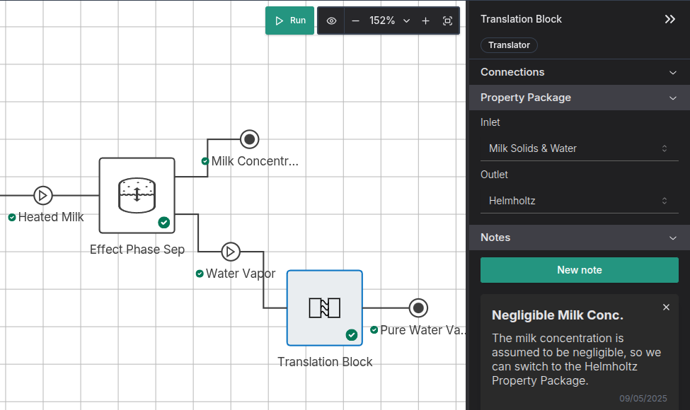

[[idaes.direct_steam_injection]] handles the case where we want to mix two streams of different property packages, and one property package has a subset of the compounds in the other property package. However, what about if we have a mixture, and we want to split out one of the compounds and model that seperately? For example, we have a property package that's good for milk, but can't really model pure steam that well - and just like how we inject steam with the [[idaes.direct_steam_injection]] we also need to extract steam.



To do that, I built a generic translator block. It has one inlet and one outlet, and the streams are supposed to be at the same conditions at both, just in different property packages. The initial implementation:

- Writes a constraint that the temperature must be the same on the inlet and outlet
- Writes a constraint that the pressure must be the same on the inlet and outlet
- Writes constraints that the composition must be the same on the inlet and the outlet.

```python
        @self.Constraint(self.flowsheet().time)
        def eq_outlet_pressure(b, t):
            return b.properties_in[t].pressure == b.properties_out[t].pressure

        @self.Constraint(self.flowsheet().time)
        def eq_outlet_temperature(b, t):
            return b.properties_in[t].temperature == b.properties_out[t].temperature
        
        @self.Constraint(
            self.flowsheet().time,
            self.config.outlet_property_package.component_list,
        )
        def eq_outlet_composition(b, t, c):
            return 0 == sum(
                b.properties_out[t].get_material_flow_terms(p, c)
                - b.properties_in[t].get_material_flow_terms(p, c)
                for p in b.properties_out[t].phase_list
                if (p, c) in b.properties_out[t].phase_component_set
            )
```

See [this commit](https://github.com/bertkdowns/direct_steam_injection/commit/c2df53d8ed080f35602c11c280a97b8645415b5f) for the full unit model.

This mostly works quite well. However, it doesn't handle a critical factor: Vapor Fractions.
In theory, when you have a mixture, you can fully define the stream like that, becuase the vapor fraction changes as the temperature changes. However,

 1. We want to model pure steam, which at `1 atm` of pressure boils at exactly `100 degC`, i.e it can be 100 degrees celcius and anywhere in between 0 and 1 degrees celcius
 2. Even if we try use the method in [[idaes.ph_formulation]] to make sure there is no zero gradient in temperature, there is a HUGE change in enthalpy at this point. 
 it takes 5 times more energy to heat water from 99 to 101 degrees Celcius than it does to heat water from 1 to 99 degrees celcius! This means that a slight difference in temperature could mean a massive difference in enthalpy, and therefore the vapor fraction could be way off. 

Table: Enthalpy of water at 101325 kPa (1 atm)

Temperature (degC)  | 	Enthalpy (J, Helmholtz)
---                 |   ---
1                   |	77
99                  |	7474
101                 |	48236

This wasn't very good. If the two property packages calculated a slightly different boiling point, the translator would instantly vaporise or cool your liquid, and a bunch of energy would appear or disappear into your system.

I looked into setting the vapor fraction as well, rather than just calculating it from the temperature, but that isn't very clean. I could adjust my property package to set the flow of each phase component, rather than each component, must balance:

```python
@self.Constraint(
    self.flowsheet().time,
    self.properties_out.phase_component_set,
    self.properties_out.phase_component_set,
    doc="Mass balance for the outlet",
)
def eq_outlet_composition(b, t, p, c):
    return b.properties_out[t].get_material_flow_terms(p, c) == \
        b.properties_in[t].get_material_flow_terms(p, c)
```

However this made the system over-defined for pure components. With Helmholtz (state vars = Pressure-Enthalpy), you can only set pressure, enthalpy, and flow. Now we're trying to set two values for flow - one for liquid and one for vapor - and so you get a too few Degrees of freedom error. 

We could fix this by removing the first value every time - just set the flow for liquid, and calculate the flow for vapor. This works sometimes, unless you're in the vapor region. If the temperature is even slightly off (e.g 99 deg C at 1 atm), and you say there is some vapor (even 1% vapor) it will be infeasible (you can't have water vapor at 99 degrees celcius, that's only possible at 100 deg C). 


Maybe there's some way you could get around this, using some sort of regression to minimise the error in both temperature and vapor fraction (maybe weighting vapor fraction as much more important or something), but that seems kinda sus.

So, we've got to do things properly, by using [[idaes.reference_enthalpies]].


The translator implementation is avaliable at (https://github.com/bertkdowns/direct_steam_injection)[https://github.com/bertkdowns/direct_steam_injection]

[[idaes.reference_enthalpies]]