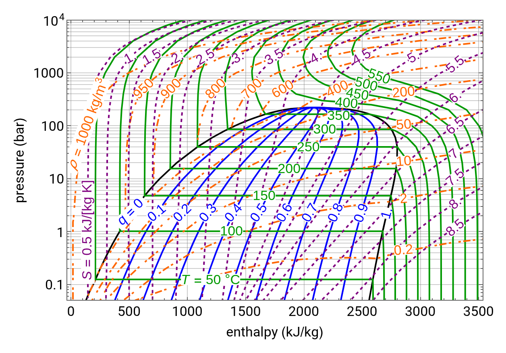
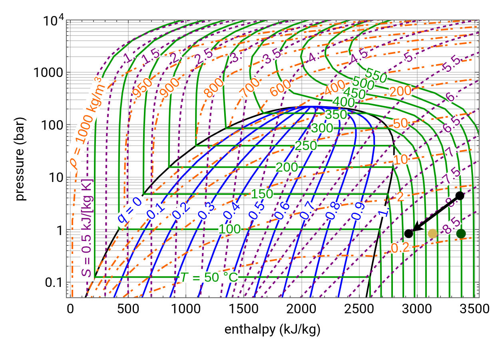

The default turbine in idaes has a number of properties, as well as the inlet and outlet states:

- Isentropic Efficiency
- Mechanical Work
- Isentropic Work
- Pressure Drop

The turbine has two degrees of freedom (DOF), which mean two of these need to be fixed. In the example below it is formulated as though deltaP and efficiency_isentropic are the degrees of freedom to fix, and everything else is calculated from then, but of course you could fix others and back-calculate them.

# Unit model structure

If you are defining a turbine in terms of isentropic efficiency, you need to know what is the maximum theoretical efficiency of a turbine. 

This is done my seeing how much enthalpy the turbine would release if it dropped to a lower pressure, but retained the same entropy (isentropic). We can do that by following this graph:

[(sourced from demostrations.wolfram.com)](https://demonstrations.wolfram.com/PressureEnthalpyDiagramForWater/)

The purple lines are lines of constant entropy, the green lines are lines of constant temperature, the blue lines are constant vapor quality, and the orange lines are constant density. We only really care about constant entropy and temperature. Lets start at a high pressure in the vapor region, and move to a lower pressure, keeping constant entropy:

This final black dot represents the state of `properties_isentropic.` Note that this is a significant move along the x-axis. that difference in enthalpy (kJ/mol) is the maximum theoretical energy (kJ/mol) that you could get from a turbine. This property is `work_isentropic`.

In reality, you wouldn't get quite that much energy, so you wouldn't go quite that far right. if you only get half way across (while dropping the same pressure), your efficiency_isentropic would be 50% and your work_mechanical would be half of the work_isentropic. Your `properties_out` conditions would be described by the yellow dot.
z

# Initialisation problems

This way of calculating works pretty good. However, IDAES had an initialisation routine that started by writing an isothermal constraint, instead of writing an isentropic constraint, and solving for that. 

This means that properties_isentropic would follow the line of constant temperature and end up at the green dot. 

Now we run into problems. the solver then tries to calculate the  `work_isentropic` variable, but since this barely changed the amount of enthalpy, your `work_isentropic` is basically zero. RED FLAG! Zeros are bad in solving these problems.

Now we focus on the constraint for `work_mechanical = work_isentropic * efficiency`. If you've set work_mechanical to a non-zero number, you have a BIG problem. because `work_isentropic` is extremely small, efficiency must be extremely large to make the equation work. This either fails to solve, or when you then switch to the isentropic constraint, your efficiency is ridicuously large and it fails to bring it all the way back down. 

We fixed this by removing the isothermal constraint and initialising without it.

(PR)[https://github.com/waikato-ahuora-smart-energy-systems/Ahuora-Adaptive-Digital-Twin-Platform/pull/1588]
