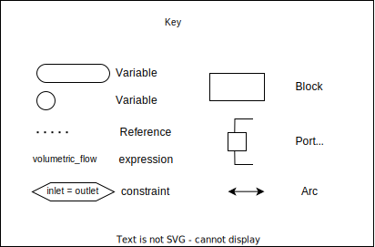
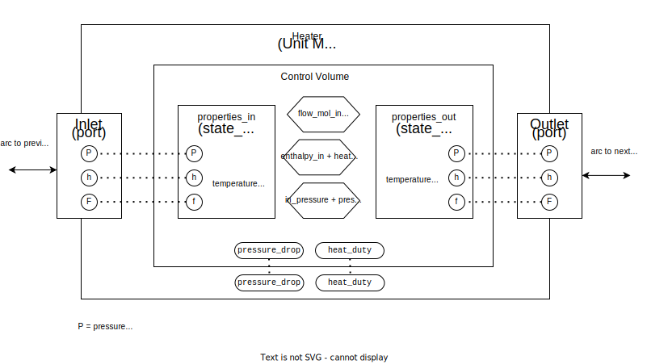
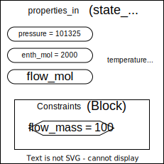

There are a number of components in idaes, which is based on pyomo: [basic pyomo components](https://pyomo.readthedocs.io/en/6.8.0/pyomo_modeling_components/index.html). This is assuming you have some understanding of variables and constraints and expressions.








This is an example of one of the simplest unit operations in IDAES. The heater is added to a  flowsheet like so:

```py
m = ConcreteModel()
m.fs = Flowsheet()
m.fs.pp = build_package("helmholtz",["water"])
m.fs.heater= Heater(property_package=m.fs.pp)
# reference to heater
heater = m.fs.heater
```

There are a number of components in the heater:

`heater.control_volume` the control volume is a reusable component to make construction of unit operations easier. It forms most of the internals of many unit operations.

`heater.inlet` and `heater.outlet` are the ports. These can be connected to other ports via `Arc` objects. This is a functionality that is rooted in the `pyomo.network` library. When an inlet is connected to an outlet, constraints are added to say that all the variables inside them must be the same.

`F`, `P` , and `h` on the diagram are shorthand for `flow_mol`, `pressure`, and `enthalpy`. For Helmholtz, these are sufficient to fully define the state of the fluid at that point, hence they are the only three properties on the port. Adding more properties would create redundant constraints: e.g it doesn't make sense to add a constraint that `flow_mass` is the same on both, because that's just calculated from `flow_mol` anyway. 

This is a little frustrating when we want to set `heater.inlet.temperature`, because it doesn't exist on the port. Instead, we have to set the state_block property, `heater.control_volume.properties_in.temperature`. Except this is an expression not a variable. Expressions are calculated from variables, and you can only fix variables, i.e you can do `flow_mol.fix()` but you can't do `flow_mass.fix()`. 

Our way around this is to do constraints:

```py
properties_in.flow_mass_constraint = Constraint(properties_in.flow_mass == 100)
```

Then we can unfix the `flow_mol` variable, and the solver can use it's solving powers to adjust the `flow_mol` variable until it meets the constraint.

to make things easier, we've added a block inside the state block to store the constraints:



All the constraints can be accessed in the `.constraints` sub_block, e.g `sb.constraints.flow_mass`

In this example, the pressure and enthalpy variables have been fixed, and so there is only one free variable, flow_mol. 
One constraint is defined, `sb.constraints.flow_mass`, that sets the value of an expression to be targeted by the solver at `sb.flow_mass == 100`.

This is used to calculate the flow_mol, and then all the other expressions are defined based on those variables and can be calculated.

However, this has problems for initialisation [[idaes.initialisation_with_custom_constraints]].