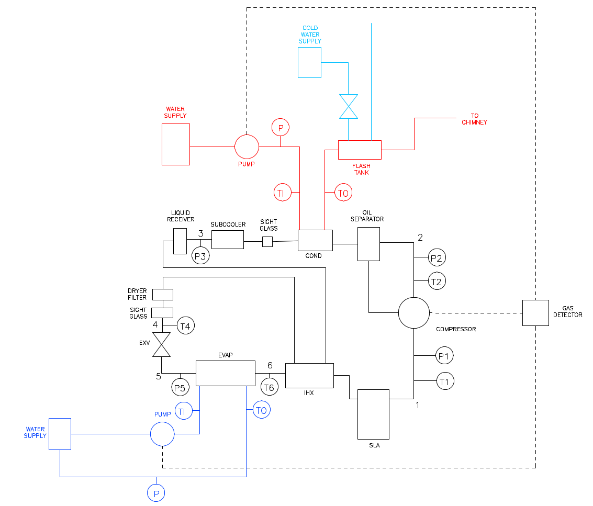
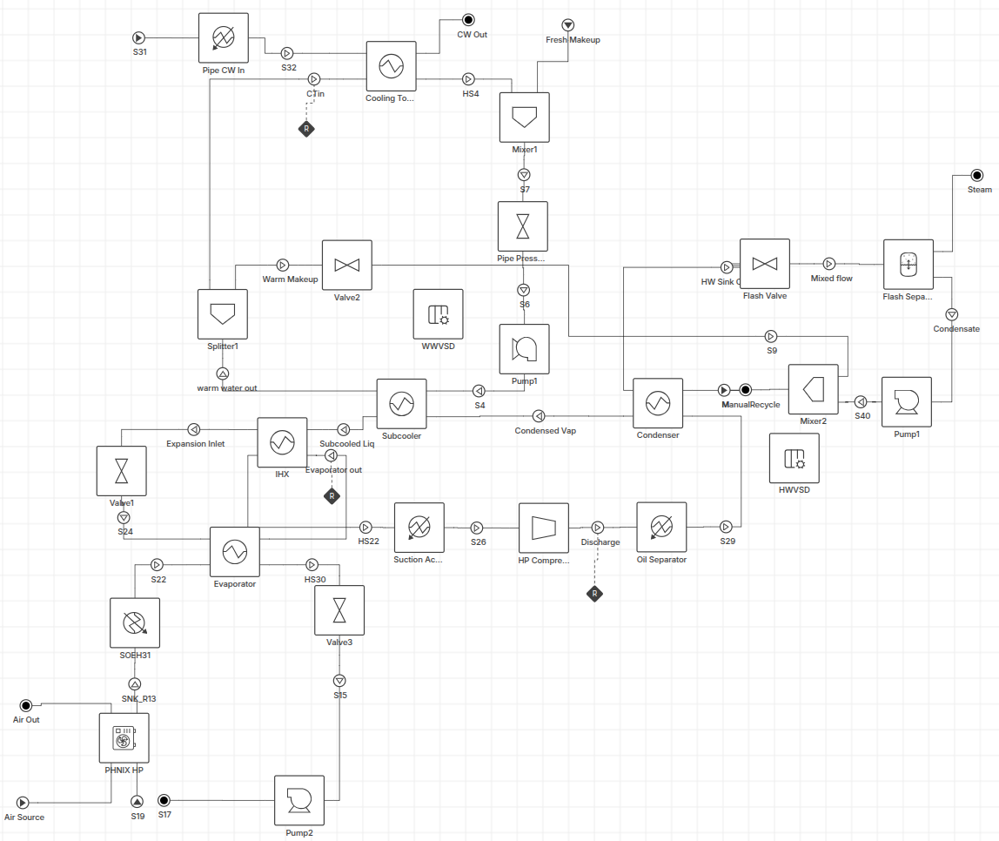
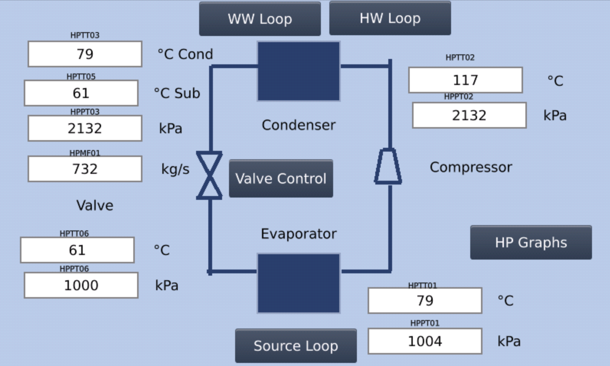
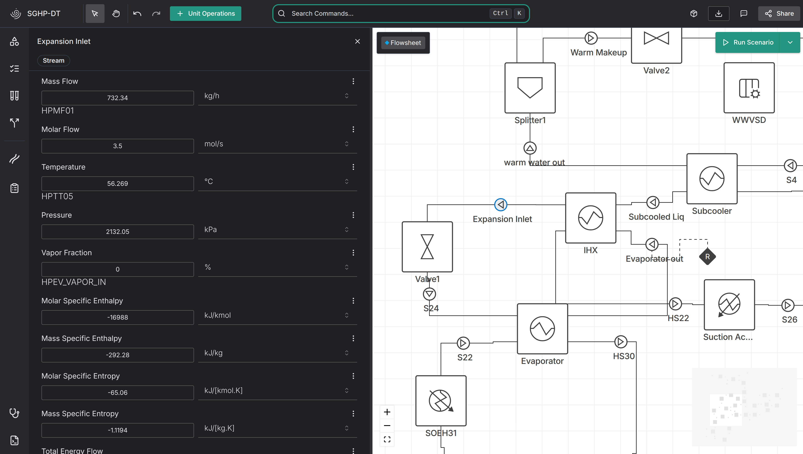
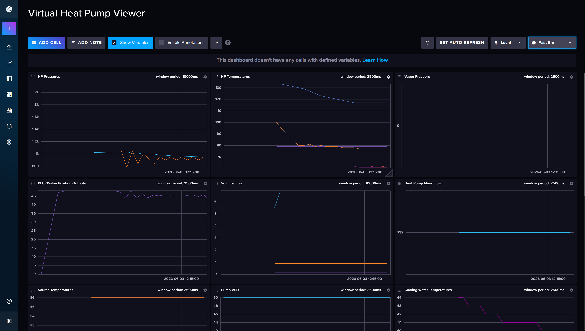

# Abstract

One of the core ideas behind Digital Twins  is that a model is complete enough to be analysed in many different ways. However, most literature discussing building Digital Twins only uses the resulting model for a single purpose. 
This paper introduces and standardises a workflow to rapidly build Process Digital Twins that can be used across the entire life cycle of the equipment, from design, to commissioning, to operation. 
We explore the creation of a Butane Steam-Generating Heat Pump Digital Twin in the Ahuora Digital Twin Platform, demonstrating how the platform enables rapid construction of Digital Twin models. The model is used for equipment sizing, testing how the heat pump will perform in a variety of conditions using a multi-steady-state analysis. This model is then adapted with minimal changes to be used for virtual commissioning, using hardware-in-the-loop testing to validate the control systems of the PLC.
The results show that the Ahuora Digital Twin Platform can significantly reduce duplication of effort through features that allow design-time models to be easily adapted to also work in commissioning tasks and beyond. We discuss how the workflow presented here can practicably be employed on other cases in the future. 

# Introduction

Digital Twins have become a very common research area over the last 10 years, including in the process engineering sector [@tao2024advancements]. Literature covers how Digital Twins provide value across the life cycle of the product, including the design phase, construction and commissioning, operation and maintenance, and reconfiguration and retrofit. This has definitely been proven in the case of building, architecture, and robotics. In the process engineering sector however, most digital twins focus on a specific part of the lifecycle, rather than aiming to be applicable to the lifecycle as a whole [@ors2020conceptual]. Data driven digital twins usually cannot be used in design time, as they require the process to be operational in order to produce the historical data required for modelling. The most common style of DT that can be used across the product lifecycle is one that is based on process simulation technologies, such as modelica [@yin2026system].

The Ahuora Digital Twin Platform is a process simulation platform built by the University of Waikato, based on the IDAES equation-oriented modelling framework [@beattie2024idaes]. The Ahuora Platform provides a simple drag-and-drop user interface to lower the barrier to entry to working with equation oriented simulators, helping to avoid common problems users may have with constructing a model. Currently, it supports steady-state modelling, multi-steady state analysis, and has experimental dynamic simulation functionality. On top of the core modelling functionality, additional features have been developed to assist with connecting to real-time systems, perform pinch analysis and heat exchanger network analysis, calculate capital and operating costs. These enhance the usefulness of the model.

The contributions of this work include:

1. A model of a Steam-Generating Butane Heat Pump in the Ahuora Digital Twin Platform, and applications for that model to design-time sizing problems, and virtual commissioning with a hardware-in-the-loop PLC,
2. A reusable framework for integrating models built in the Ahuora Digital Twin Platform with external systems for real-time analysis or optimisation,
3. A method of adjusting a steady-state model to include first-order pipe dynamics to enable it to be used in virtual commissioning or prediction scenarios with minimal extra model development.

# System Description and Model

<!-- E -->

The Steam Generating Heat Pump we are modelling uses n-butane (R600a) as the refrigerant, and produces up to 65kg of steam at 1-3 bar per hour, and hot water. The steam is produced by heating hot water at a higher temperature and pressure, and then flashing it into steam. It is being built by the Ahuora Centre for Smart Energy Systems (University of Waikato), in collaboration with Excel Refrigeration (New Zealand), Eastern Switzerland University of Applied Sciences, and Bitzer (Germany). It is the first such system in New Zealand, and the aim of the project is to increase confidence across New Zealand Industries in the technology.

A model of the Steam Generating Heat Pump, along with the source water heating loop, and hot water loop, was built in the Ahuora Digital Twin Platform. This model was built using predefined first-principles models of the valves, heat-exchangers, compressors, mixers, and splitters, already available as standard unit operations in the Ahuora Platform's unit operations library, significantly reducing the time required for modelling. N-butane and water were both modelled using Helmholtz Energy Formulations [@wagner2002iapws] [@bucker2006reference]; these compounds are also supported in the Ahuora Platform's properties libraries. Pipe Pressure Losses were modelled as valves with fixed coefficients and positions, allowing pumps to control the flow rate through the system.

# Design-time Analysis Case

<!-- Explain how variable replacement makes it easy to switch the model from an initial design to a rating mode case, possibly take some content from the variable replacement paper. -->

# Hardware-in-the-loop Virtual Commissioning

<!-- Explain how the model can be used with external systems easily -->

The PLC software for controlling the heat pump was built before the heat pump itself was built, raising the question: How do we test that the PLC is configured correctly? The software relies on temperature, pressure, and flow readings to run its PID algorithms, and actuates valves and controls the speed of the pumps in the system. 
A powerful way of testing the PLC is to use a model of the heat pump to virtualise the process itself. This model calculate the temperature, pressure and flow readings that would be expected in response to the PLC's output control signals. 

PLC controllers typically use proprietary software to develop and program their logic. The level of sophistication varies, and not all include frameworks to test, validate, or virtualise the PLC before it is integrated with the system. 
The University of Waikato settled on a Unitronics PLC to control the heat pump, but literature suggests that other PLCs face similar problems (!!Citatation needed). 
Thus, to test the system we used the real PLC, but mapped the inputs into standard memory addresses instead of analog input memory addresses. Then, we set up MQTT subscribers in the PLC to read these values in from a range of MQTT topics. Likewise, any PLC outputs were also published as MQTT topics. MQTT is a common standard for industrial communication, which makes it easy to observe these interactions from any other SCADA system or data historian.

To make it simple to connect the PLC data to the model in the Ahuora Platform, a new plugin was developed which allows users to set a tag name for each variable or calculated property in their model. This tag name could be set to follow the same conventions as the PLC. 
The Ahuora Platform's variable replacement feature was used to manipulate the model into the right format for simulating control, with the temperatures and pressures being calculated from the PLC's output variables. 
Once the model had been reconfigured, it could be downloaded from the platform. We created a server that connected to the MQTT Broker and checked for any updates on the tags in the model, before solving the model and publishing all the updated properties that were calculated. Because all the tags are stored in the Ahuora platform, this software is independent of this specific application and could easily be reused for a completely different model or PLC, as long as the model includes the tag mappings and the PLC supports MQTT with the same tag names. 

## Adding Dynamics

<!-- Explain how the recycle system enables converting the steady state model to a dynamic model with minimal effort -->

There is one major problem with the model we have discussed so far: steady state models are not always stable with recycles if too many transfer variables are set. Transfer variables implicity define the state of the stream: this can include pressure drop, mechanical work, or heat added. 
However, recycle loops make it easy to not set any state variables, which leaves the model with no reference point. 
In recycle loops, the transfer variables must also balance across the whole system. 
For example, if the mechanical work of the compressor is too high, the valve may not be able to drop the pressure down enough to the right inlet pressure. 
This causes the mathematical solver to increase the pressure out of the compressor, which in turn increases the pressure into the compressor, and so forth, leading to an unstable system.

In the real world, this is not a problem as PID loops are used to control a system to ensure that the pressure does not get too high. However, the steady-state model cannot express this. Thus, we propose a simple way to introduce dynamics into a steady state model:

1. Choose streams between the unit operations and remove the equality constraints, so the outlet does not need to equal the inlet. Instead, directly fix the properties of the inlet. 
2. Solve the model at those conditions.
3. At the next timestep, update the values of the fixed inlet based on the calculated values of the outlet. They can either be copied directly across to simulate a very fast response, or using an exponential smoothing filter. The smoothing factor then controls the system's time constant. Additionally, a buffer of past values could be stored to model time delay through the system as well.

The relationship between the smoothing factor $\alpha$, the time constant $\tau$, and the sampling interval $\Delta t$ is as follows:

$$\alpha = 1 - e^{-\frac{\Delta t}{\tau}}$$

Thus, the model may be tuned to reflect the expected response time of the system, with minimal additional modifications required to make an existing steady-state model work.

### Limitations

In many models, removing the equality constraints in this way is perfectly fine. However, there are some times when this does result in structural degeneracies in the model. This is typically the case when the property of a unit operation upstream of the breakpoint is being specified by a condition downstream of the breakpoint. However this is relatively easy to identify and reformulate: a good intuition is that if a property is being replaced "across" the breakpoint, the model will probably have a degeneracy. IDAES and Ahuora also include tools to automatically identify these points so they can manually be reformulated.

## Running the model

After connecting the model to the PLC, the PLC could interact in the same manner as it would in the physical system, with all the temperatures and pressures of the system showing as they would if the real heat pump were connected. We could verify that the PLC was working correctly and fix any bugs we found in the PLC's internal logic.

A Telegraf data ingestion pipeline was setup to store the MQTT messages in a time-series database to allow visualisation of historical trends. This allowed us to view how the PID systems of the control system interacted with the model of the heat pump to stabilise the process and bring it to equilibrium over time.

This virtual commissioning also provided a good training environment, as future plant operators could learn how the control systems work and how the process responds, without having to worry about damaging any equipment.

One limitation of this approach for virtual commissioning is that mathematical models become unstable and fail to solve under conditions of zero flow, as the temperatures and pressures are undefined. This means that the model was not quite suitable to model startup and shutdown procedures, without smoothing methods to ensure a minimal amount of flow is always present.

# Discussion

<!-- Argue that the variable replacement and the recycling system outlined here can easily be applied to other models. -->
The approach used in this Butane Heat Pump could easily be applied to other process models built in the Ahuora Platform. Variable replacement is a generic technique that is alreadyused across all models in the Ahuora Platform, and it enables easily using models for different scenarios. Likewise, removing stream constraints between unit operations and manually recycling values across at each timestep is a simple way of adding dynamics that doesn't require any specific model configuration.

<!-- Argue that the mqtt workflow etc will pretty much work for whatever case you have. -->
At the most fundamental level, solving a model is simply setting the appropriate values for each variable and solving. The MQTT layer provides a nice abstraction to manipulate the data into the correct shape. While not all systems are setup to work with MQTT, it is common to have translation layers to convert other protocols to and from MQTT, which makes it interoperable with virtually any other data collection system. 

# Conclusions

# Bibliography
