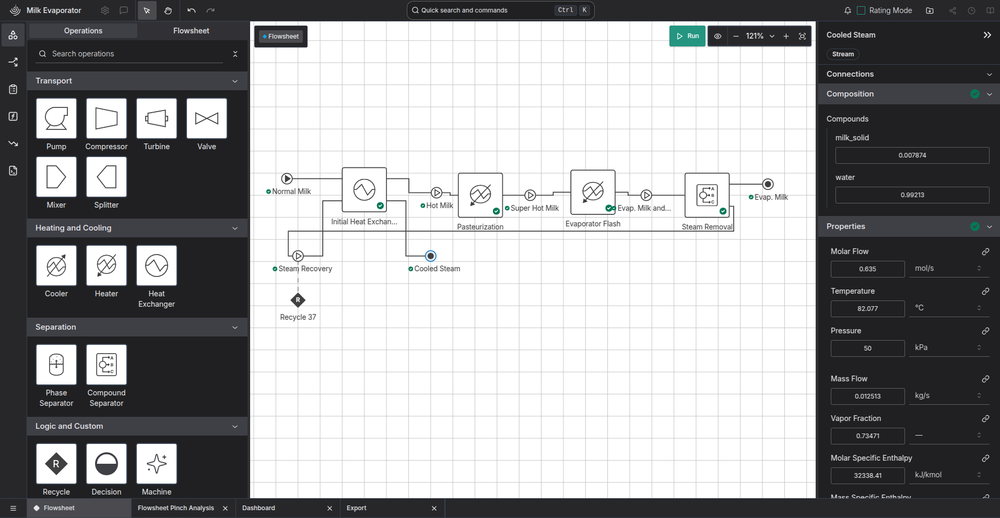

# Introduction

The major innovations of the industrial revolution were not new products. Textiles, clothing, paper, iron and agricultural products all existed prior. The innovation lay in the method of creating textiles, clothes, and other goods through factories, assembly lines, and mass production.

Many other innovations have gone through similar cycles. Early websites were hand-crafted by a professional programmer, now a website builder can have something up and running in seconds.

Digital Twin technology is at a similar state to the hand-produced goods of the early 19th century. It has been proven benificial in a variety of industries, including the discipline of process engineering. 

However, the cost to develop a digital twin system is still high. This is because most are custom, manually written software systems. This is in part due to the inherent complexity of the task; no two factories are exactly the same. However, a generally-applicable method of building and running Digital Twin systems could make them accessible to more factories and processes, increasing their reliability and efficiency, reducing downtime and waste.

## Project Context

"Project Ahuora" is a Ministry of Business, Innovation, and Employment funded project that aims to decarbonise the process heat sector, saving costs and reducing New Zealand's greenhouse gas emmissions. 

As part of this effort, a Digital Twin Platform is being developed. This Web-Based platform allows a user to model a chemical process and simulate it in steady-state using IDAES-PSE [@lee2021idaes]. This allows a more user-friendly approach to access IDAES's powerful optimisation tools, which it is anticipated will enhance uptake in industry. 
However, the objective is to expand this platform to include an exhaustive amount of information on the process, more than is required for a conventional process simulation. 
This will enable further analysis methods to also be applied, such as Heat Exchanger Network Synthesis [@yee1990simultaneous] and Pinch Analysis [@walmsley2015pinch] without requiring a seperate tool.

The benefit the Ahuora Platform will provide to industry will be determined by two things: (1) the cost of setting up a Digital Twin in the Ahuora platform, and (2) the value, in terms of efficiency and reliability gains, of using the software. 

The cost to setup a Digital Twin can be reduced in a variety of ways as identified in the literature review. Automated translation of P&ID diagrams, as well as support for external model formats and standardised interfaces, reduce the amount of rework required to make existing documents compatible. Following a standardised framework for a Digital Twin, rather than creating a customised solution every time, can also decrease the cost. 
This has been shown in other industries, such as in the prevalence of website-building and e-commerce store setup platforms, that lower the barrier to entry by standardising what once required a custom implementation. There is evidence of tools to simplify building digital twins in other areas, but there is little in this space for Process Simulation. Novel techniques, such as recent developments in the field of Artificial Intelligence and surrogate modelling, may enable this in ways that were previously not possible.

The value of the software can be increased by adding more methods of analysis and increasing the applicability of the software. These tools can include both design-time and operation-time optimisations. Being able to use the same model for both cases would increase the DT's value to a company. Novel techniques such as process emulation, and integration with standardised protocols such as OPC-UA, could be implemented in the platform. However, ensuring these techniques increase the value of the software to businesses will require careful consultation with industry stakeholders and a variety of case studies.

\newpage
