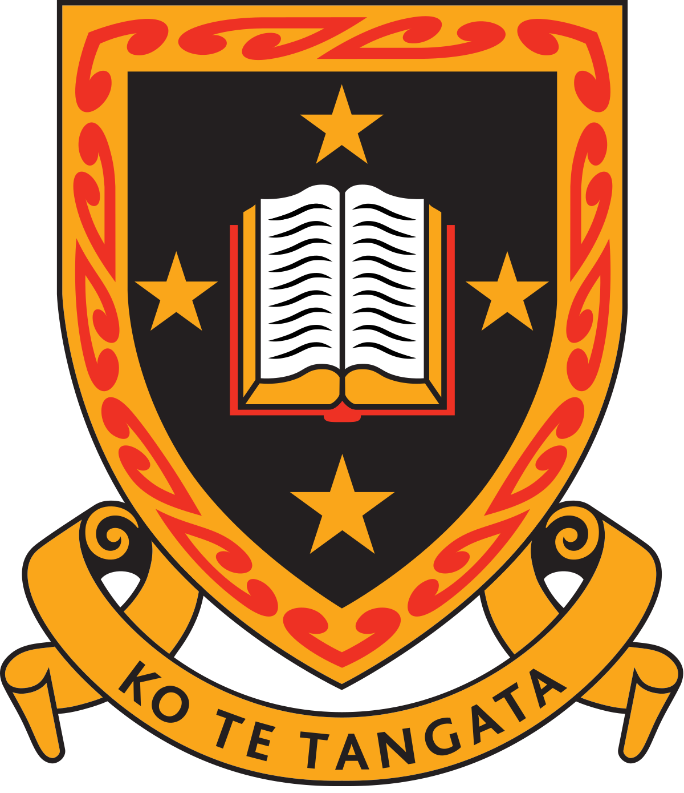

# 

## A Software Engineering Approach to the Design and Application of Digital Twins in Industrial Chemical Processes

### Author
**Bert Downs**  
Supervised by Tim Walmsley, Jason Kurz, Mark Apperley  

### Date
**March 2025**

---

## Abstract

---

## Acknowledgements

I would like to thank my supervisors, Tim Walmsley, Jason Kurz, and Mark Apperley, for their guidance and support throughout this project. I would also like to thank the Ahuora project team for their assistance and feedback. Finally, I would like to thank my family and friends for their encouragement and support.

---

## Table of Contents

---

## List of Figures

---

## List of Tables

---

## List of Abbreviations

| Abbreviation | Description |
|--------------|-------------|
| IDAES-PSE    | Institute for the Design of Advanced Energy Systems - Process Simulation Environment |
| SCADA        | Supervisory Data Acquisition and Control |
| PYOMO        | PYthon Optimisation MOdelling language |
| PDE          | Partial Differential Equation |
| RBF          | Radial Basis Function |
| RBON         | Radial Basis Operator Network |
| PYSMO        | Python-based Surrogate Modelling Objects |
| OMLT         | Optimization and Machine Learning Toolkit |

---

## Chapters

- [[proposal.introduction]]
- [[proposal.litreview]]
- [[proposal.proposal]]

---

## References

References are included in the `refs.bib` file.

---

## Appendices
