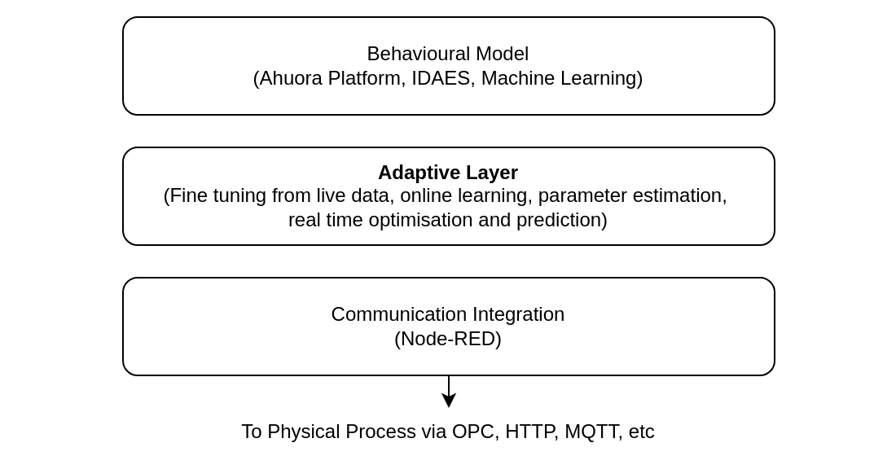

# Conclusion

It is evident there are a lot of different tools involved in building a Digital Twin. The case studies discussed also apply the tools differently - some for control, some for fault detection, and some for scheduling. This is why building Digital Twin systems is so complicated. 

However, all still use the same general elements - a model of the key dynamic behaviour of the physical system and a method to communicate with the physical system. The problem lies in the intersection of these domains. Good models exist, and good communication protocols exist. Getting a model that can communicate with a physical system and reflect any changes is much harder.

The Ahuora Platform's current strength is on modelling. Because it is built on pyomo, it has the flexibility to do both first principles and data driven modelling, and can likely be made compatible with other model standards. 

There are also good tools to solve problem of diverse communication protocols. Platforms like Node-RED can make it easy to aggregate data from a variety of sources, and communicate back to a variety of external systems.

We need to make it easy for a model in the Ahuora Platform adapt to changes in, and communicate with, a physical system. I visualise this as a layer in between the model itself and the communication systems.

The behavioural model estimates how the physical system has changed in response to an input. However, the adaptive layer estimates how the *model* should change in response to a series of inputs. This can be done though online machine learning or parameter estimation methods. This allows the model to continue to accurately represent the physical process, even in the case of physical performance degradation and other environmental changes. 

The adaptive layer also estimates how the physical system should be changed. This can be done using optimisation based on the predictions of the behavioural model.

This will be the area I target to minimise complexity, as this is where the majority of the work in building a Digital Twin comes from. Developing a methodology and framework to do so will pave the way for broader adoption of Digital Twin technology for reliable and efficient process operation.

\pagebreak

# Bibliography
