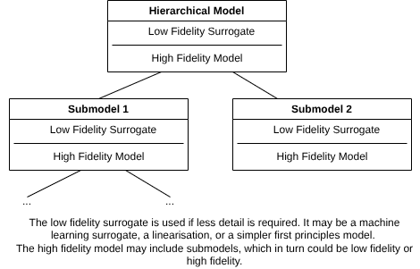
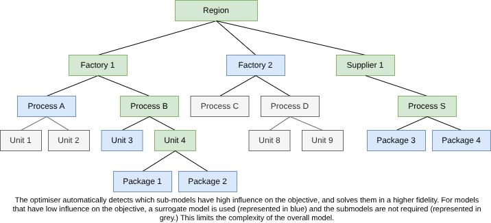

This research investigates methods for automatically selecting the appropriate fidelity of process sub-models during simulation and optimisation. The goal is to minimise computational cost while maintaining sufficient accuracy by dynamically determining which components of a system require detailed representation and which can be represented using simpler abstractions.

# Background

Digital Twins typically combine vastly different model scales into one integrated world. Mapping systems are an example of this, where different levels of detail are seamlessly accessible based on the current scale.
Likewise, there are different levels of detail we model an energy system at, depending on the size of our system boundary for a problem.

- If we model a heat exchanger, we may decide that a 1-d discretised model is sufficient detail to assess its performance and suitability.
- If we model a heat pump, we made decide modelling the same heat exchanger using a log-mean-temperature difference approximation is sufficiently accurate.
- When we model the heat pump as part of a utility system, we may simplify it to a COP performance curve or surrogate model.
- In a regional model, the plant may be modelled as an electricity demand profile in response to price changes.

Each of these model scales can be represented in an Equation Oriented Model. Typically, each of these levels of fidelity are modelled completely separately. 
I present an alternative solution: An extremely large, high-fidelity equation oriented model of a region, built over time, combining the different simpler models into one. 
For each case study, a modeller would choose a level of detail and system boundary appropriate for their problem, extracting a sub-model they can feasibly solve. 
This would create a multi-level Digital Twin, and provide better insight into the constraints present on a larger or smaller scale that may be limiting factors in finding an optimal solution.

# Plan

The first part of this project would involve creating a framework to model multilevel problems.
This can be done by decomposing the model into a hierarchical structure. At each level, a high-fidelity model is present, potentially with further sub-models, and a low-fidelity model is used to approximate the system when the detail is not required. The two models are designed in a way that they are interchangable in a larger system. 
My research would investigate how to build a system architecture that supports this, the properties and limitations of this architecture, and create an implementation of multilevel modelling in pyomo. OMLT could be used to automatically generate surrogates of the high-fidelity models.

The second part would focus on automatically increasing fidelity of models in an optimisation problem. 
Improved convergence in optimisation problems could result from first optimising using low fidelity approximations, then increasing fidelity to further refine the objective.
Automatic methods could be developed to identify which sub-models the objective is most sensitive to, so that higher fidelity models can be used in their place. 
Sub-models that the objective is not sensitive to can be left low-fidelity, to reduce the mathematical complexity of solving.

This would likely involve analysing the jacobian of the surrogate model or performing sensitivity analysis to determine if the objective is sufficiently sensitive to warrant using a higher fidelity approximation. Heuristic methods could be developed or a secondary optimisation problem could be solved to minimise inaccuracies for a given level of model complexity.

## Related areas of research

*Identifying the best style of low-fidelity model to use.* Where is it appropriate to use data-driven surrogate models? What is the best way to simplify or linearise a model?

*Initialising Hierarchical Models.* Having a low-fidelity and high-fidelity model of each part of the system may help create reusable, standardised initialisation routines. This may improve solving reliability

*Diagnosing problems in a multi-level model*. If a model fails to solve and we can identify which sub-model is the constraining factor, we can then inspect inside the sub-model to identify why it is a problem. We can also easily replace a sub-model with its approximation to see if there is some degeneracy or infeasibility in the sub-model that the approximation smooths over. This may make multi-level models more maintainable.
