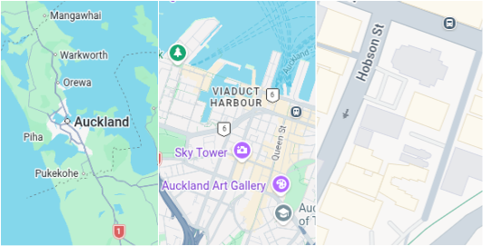
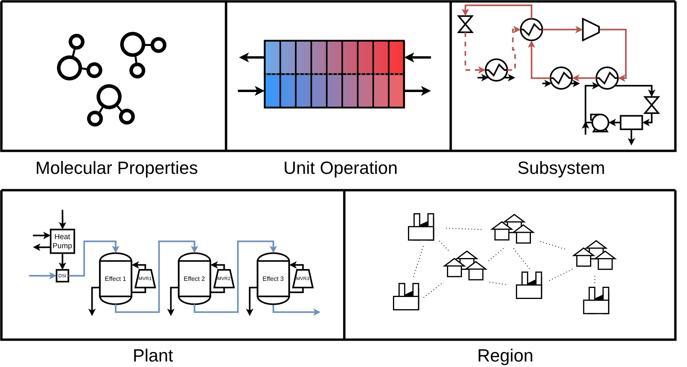

There are different levels of detail we model an energy system at, depending on the size of our system boundary for a problem.

- If we model a heat exchanger, we may decide that a 1-d discretised model is sufficient detail to assess it's performance and suitability.
- If we model a heat pump, we made decide modelling the same heat exchanger using a log-mean-temperature difference approximation is sufficiently accurate.
- When we model the heat pump as part of a utility system, we may simplify it to a COP performance curve or surrogate model.
- In a regional model, the plant may be modelled as an electricity demand profile in response to price changes.

Each of these model scales can be represented in an Equation Oriented Model. Typically, each of these levels of fidelity are modelled completely seperately. A digital twin that allows us to view the system state across each of these levels could provide better insight into the constraints present on a larger or smaller scale that may be limiting factors in finding an optimal solution. A large, high-fidelity equation oriented model of a region could be built over time by many researchers, with different users choosing a level of detail and system boundary appropriate for their problem, and extract a sub-model they can use. This would also encourage collaboration and re-use across the modelling community.

I would like to research:

*How different levels of abstraction can be combined seamlessly, such that a user can choose a suitable system boundary and level of abstraction to model their problem.* This can be done by decomposing the model into a hierarchical structure. At each level, a high-fidelity model is present, potentially with further sub-models, and a low-fidelity model is used to approximate the system when the detail is not required. The two models are designed in a way that they are interchangable in a larger system. My research would investigate how this would work across the different scales, and creating an architecture to do so in pyomo.

*How to initialise hierarchical models.* Having a low-fidelity and high-fidelity model of each part of the system may help create reusable, standardised initialisation routines.

*How to better decompose and pinpoint problems in a multi-level model*. If a model fails to solve and we can identify which sub-model is the constraining factor, we can then inspect inside the sub-model to identify why it is a problem. We can also easily replace a sub-model with its approximation to see if there is some degeneracy or infeasibility in the sub-model that the approximation smooths over.

*Automatically increasing fidelity of models in an optimisation problem.* Improved convergence in optimisation problems could result from first optimising using low fidelity approximations, then increasing fidelity to further refine the objective. Automatic methods could be developed to identify which sub-models the objective is most sensitive to, so that higher fidelity models can be used in their place. Sub-models that the objective is not senstive to can be left low-fidelity, to reduce the mathematical complexity of solving.

